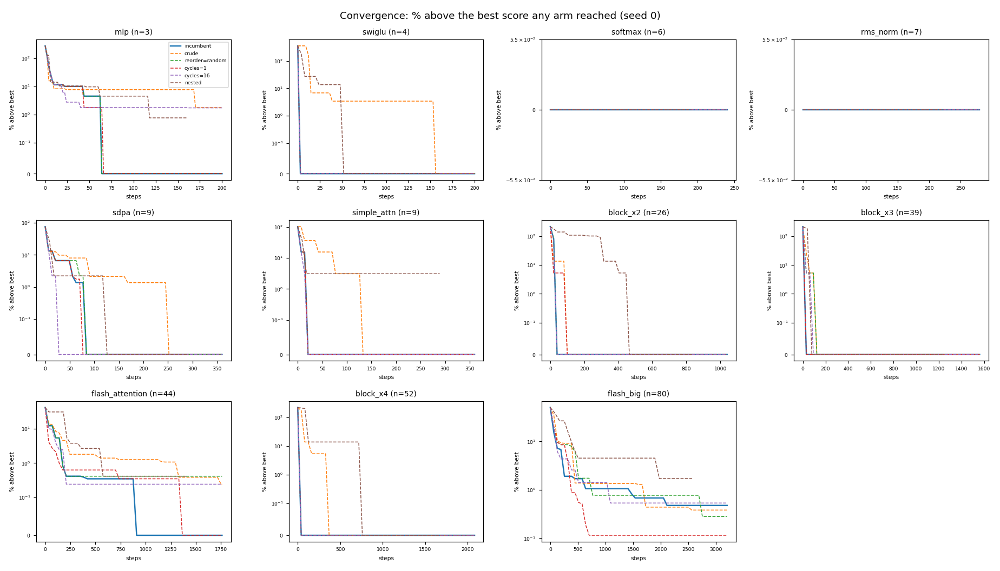

# Convergence: which option gets there soonest

Steps until an arm's best-seen score is within a tolerance of the best score *any* arm reached on that graph, at the default `steps_per_buffer=40`, 5 seeds, capacity `footprint//2`. Lower is sooner. `final gap` is where the arm ends up, which is what every other benchmark in this series reports.

## Per arm

| arm | median steps to within 1% | to within 0.1% | mean final gap % | first to arrive (graphs) |
|---|--:|--:|--:|--:|
| `incumbent` | 40 (10/11) | 34 (8/11) | +0.09 | 3 |
| `crude` | 82 (10/11) | 80 (8/11) | +0.13 | 0 |
| `reorder=random` | 42 (10/11) | 40 (8/11) | +0.08 | 1 |
| `cycles=1` | 39 (10/11) | 32 (8/11) | +0.09 | 2 |
| `cycles=16` | 44 (10/11) | 33 (8/11) | +0.10 | 4 |
| `nested` | 196 (6/11) | 196 (6/11) | +0.74 | 0 |

## Per graph: steps to within 1% of the best any arm reached

| graph | n | `incumbent` | `crude` | `reorder=random` | `cycles=1` | `cycles=16` | `nested` |
|---|--:|--:|--:|--:|--:|--:|--:|
| mlp | 3 | never | never | never | never | never | never |
| swiglu | 4 | 29 | 80 | 43 | 25 | 25 | 49 |
| softmax | 6 | 0 | 0 | 0 | 0 | 0 | 0 |
| rms_norm | 7 | 0 | 0 | 0 | 0 | 0 | 0 |
| sdpa | 9 | 39 | 133 | 39 | 38 | 63 | never |
| simple_attn | 9 | 24 | 69 | 24 | 24 | 20 | never |
| block_x2 | 26 | 56 | 84 | 56 | 64 | 48 | 343 |
| block_x3 | 39 | 56 | 81 | 56 | 56 | 50 | 540 |
| flash_attention | 44 | 224 | 616 | 217 | 161 | 175 | never |
| block_x4 | 52 | 41 | 205 | 41 | 41 | 41 | 417 |
| flash_big | 80 | 1254 | 1280 | 589 | 1139 | 602 | never |

## Reading this

A tie in `final gap` with a difference in `steps to within 1%` is an arm that reaches the same place faster -- invisible to every endpoint sweep in this series, and the state `schedule` turned out to be in. A tie in both is a genuine non-difference. `never` means the arm did not reach the bar inside the default budget on some graph, which is the case a mean over the arrivals would quietly drop.

