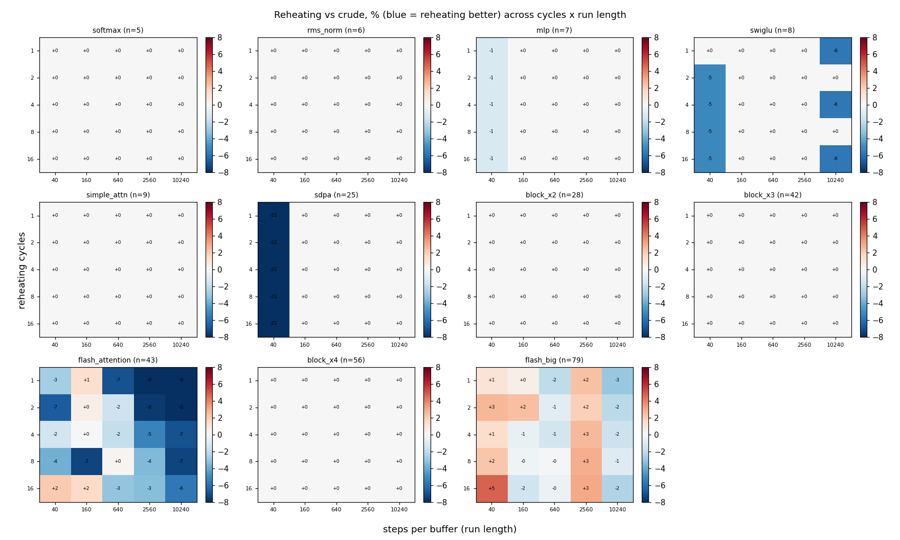

# Reheating cycle-count x run-length product sweep

Reheating schedule with `cycles` in [1, 2, 4, 8, 16] x `steps_per_buffer` in [40, 160, 640, 2560, 10240], 5 seeds/cell, capacity `footprint//2`. `cycle length = total_steps / cycles`, so `cycles=1` is a single long cool (no reheating) and larger values are more, shorter reheats. Heatmap cells are reheating-vs-crude % (blue/negative = reheating better).

## Headline finding

**The cycle count only matters on the graphs where the schedule already mattered,
and there the answer is "fewer cycles, more so at longer runs" -- the default
`cycles=4` is mildly suboptimal.**

- **8 of 11 graphs are cycle-insensitive** (softmax, rms_norm, mlp, simple_attn,
  sdpa, block_x2/x3/x4): every cycle count 1..16 lands the same score (0% spread).
  Where both schedules already converge to the same optimum, splitting the budget
  into more/fewer reheats changes nothing.
- **flash_attention (n=43): fewer cycles is better, and the ranking sharpens with
  run length.** At the longest run (spb 10240) it is monotonic: `cycles=1` -8.9%
  vs crude, 2 -8.2%, 4 -7.0%, 8 -7.4%, 16 -5.7%. At short runs the best cycle
  count is finicky and higher (2 at spb 40, 8 at spb 160) and `cycles=16` is even
  *worse* than crude at spb 40 (+2%). So the optimal cycle count **depends on run
  length** -- the product-space interaction the sweep set out to find.
- **flash_big (n=79): same shape, noisier** (spreads 1-4%): `cycles=1` is best at
  the longest run (-3.0%) but the surface is bumpy across seeds.

**Interpretation.** The reheating *cycling itself* is not where the schedule's win
over crude comes from -- a single long cool (`cycles=1`, i.e. no reheating) already
captures the full advantage (flash_attention -8.9% at the longest run). The gain
is from the schedule's per-move self-calibrating bands + cycle-phase proposal mix;
extra reheats mildly *disrupt* an otherwise-converging search at long budgets.
**Actionable:** consider lowering the default `cycles` (4 -> 1-2), at least for
larger graphs / longer budgets, or making it adaptive; the current 4 leaves ~2%
on the table on the graphs that matter.

_Caveats: capacity = footprint//2; y is the SA fixed-point objective, not
wall-clock; flash_big is noisy across seeds; cycle count only bites where the
schedule is not already saturated._

## Best cycle count per (graph, run length)

| graph | n | spb | total steps | best cycles | reheat(best) vs crude % | cycles=4 vs crude % |
|---|--:|--:|--:|--:|--:|--:|
| softmax | 5 | 40 | 200 | 4 | +0.00 | +0.00 |
| softmax | 5 | 160 | 800 | 8 | +0.00 | +0.00 |
| softmax | 5 | 640 | 3200 | 8 | +0.00 | +0.00 |
| softmax | 5 | 2560 | 12800 | 16 | +0.00 | +0.00 |
| softmax | 5 | 10240 | 51200 | 16 | +0.00 | +0.00 |
| rms_norm | 6 | 40 | 240 | 1 | +0.00 | +0.00 |
| rms_norm | 6 | 160 | 960 | 1 | +0.00 | +0.00 |
| rms_norm | 6 | 640 | 3840 | 1 | +0.00 | +0.00 |
| rms_norm | 6 | 2560 | 15360 | 1 | +0.00 | +0.00 |
| rms_norm | 6 | 10240 | 61440 | 1 | +0.00 | +0.00 |
| mlp | 7 | 40 | 280 | 1 | -1.20 | -1.20 |
| mlp | 7 | 160 | 1120 | 2 | +0.00 | +0.00 |
| mlp | 7 | 640 | 4480 | 2 | +0.00 | +0.00 |
| mlp | 7 | 2560 | 17920 | 4 | +0.00 | +0.00 |
| mlp | 7 | 10240 | 71680 | 2 | +0.00 | +0.00 |
| swiglu | 8 | 40 | 320 | 2 | -5.13 | -5.13 |
| swiglu | 8 | 160 | 1280 | 2 | +0.00 | +0.00 |
| swiglu | 8 | 640 | 5120 | 1 | +0.00 | +0.00 |
| swiglu | 8 | 2560 | 20480 | 1 | +0.00 | +0.00 |
| swiglu | 8 | 10240 | 81920 | 1 | -5.71 | -5.71 |
| simple_attn | 9 | 40 | 360 | 1 | +0.00 | +0.00 |
| simple_attn | 9 | 160 | 1440 | 1 | +0.00 | +0.00 |
| simple_attn | 9 | 640 | 5760 | 1 | +0.00 | +0.00 |
| simple_attn | 9 | 2560 | 23040 | 1 | +0.00 | +0.00 |
| simple_attn | 9 | 10240 | 92160 | 1 | +0.00 | +0.00 |
| sdpa | 25 | 40 | 1000 | 1 | -21.05 | -21.05 |
| sdpa | 25 | 160 | 4000 | 2 | +0.00 | +0.00 |
| sdpa | 25 | 640 | 16000 | 2 | +0.00 | +0.00 |
| sdpa | 25 | 2560 | 64000 | 1 | +0.00 | +0.00 |
| sdpa | 25 | 10240 | 256000 | 1 | +0.00 | +0.00 |
| block_x2 | 28 | 40 | 1120 | 1 | +0.00 | +0.00 |
| block_x2 | 28 | 160 | 4480 | 1 | +0.00 | +0.00 |
| block_x2 | 28 | 640 | 17920 | 1 | +0.00 | +0.00 |
| block_x2 | 28 | 2560 | 71680 | 1 | +0.00 | +0.00 |
| block_x2 | 28 | 10240 | 286720 | 1 | +0.00 | +0.00 |
| block_x3 | 42 | 40 | 1680 | 1 | +0.00 | +0.00 |
| block_x3 | 42 | 160 | 6720 | 1 | +0.00 | +0.00 |
| block_x3 | 42 | 640 | 26880 | 1 | +0.00 | +0.00 |
| block_x3 | 42 | 2560 | 107520 | 2 | +0.00 | +0.00 |
| block_x3 | 42 | 10240 | 430080 | 1 | +0.00 | +0.00 |
| flash_attention | 43 | 40 | 1720 | 2 | -6.67 | -1.51 |
| flash_attention | 43 | 160 | 6880 | 8 | -7.32 | +0.04 |
| flash_attention | 43 | 640 | 27520 | 1 | -6.97 | -1.89 |
| flash_attention | 43 | 2560 | 110080 | 1 | -8.01 | -5.36 |
| flash_attention | 43 | 10240 | 440320 | 1 | -8.93 | -6.96 |
| block_x4 | 56 | 40 | 2240 | 1 | +0.00 | +0.00 |
| block_x4 | 56 | 160 | 8960 | 1 | +0.00 | +0.00 |
| block_x4 | 56 | 640 | 35840 | 1 | +0.00 | +0.00 |
| block_x4 | 56 | 2560 | 143360 | 1 | +0.00 | +0.00 |
| block_x4 | 56 | 10240 | 573440 | 1 | +0.00 | +0.00 |
| flash_big | 79 | 40 | 3160 | 1 | +1.04 | +1.43 |
| flash_big | 79 | 160 | 12640 | 16 | -1.61 | -0.62 |
| flash_big | 79 | 640 | 50560 | 1 | -2.01 | -1.44 |
| flash_big | 79 | 2560 | 202240 | 2 | +1.90 | +2.61 |
| flash_big | 79 | 10240 | 808960 | 1 | -3.01 | -1.70 |
