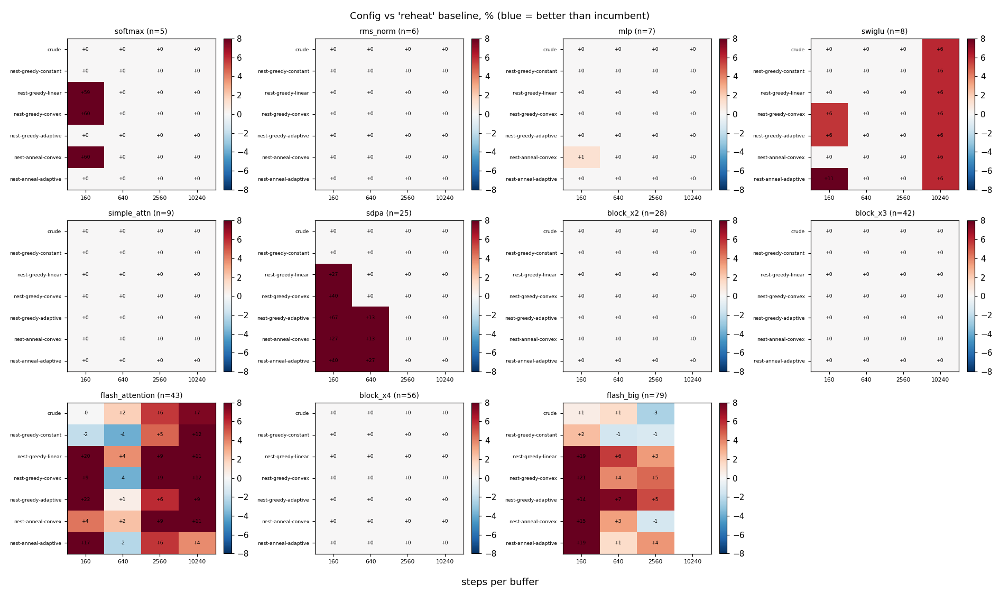
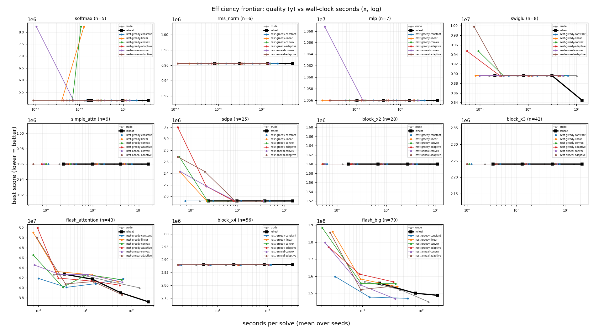

# Nested two-timescale SA vs the single-loop engine (A/B)

Nested variants (greedy/annealed inner x constant/linear/convex/adaptive length curve) vs crude and the incumbent `reheat`, over run length, 5 seeds, capacity `footprint//2`. `delta%` and the frontier are both vs `reheat`. Wall-clock is recorded because the nested inner loop skips the per-step rescore, so quality-vs-time is the honest efficiency axis.

## Headline finding

**The nested two-timescale engine is substantially more time-efficient: on 9 of
11 graphs a single fixed config (`nest-greedy-constant`) matches or beats the
incumbent `reheat`'s *best* quality in 1.8-14.4x less wall-clock** (median ~2.7x;
flash_big 14.4x -- 13s vs 191s; sdpa 3.1x). The efficiency frontier (quality vs
seconds) shows the nested curves sitting left of the incumbent on those graphs.

Where the win comes from:

- **Skipping the per-step full rescore.** The incumbent scores the whole state
  every step; the nested inner layout loop drives the packer's incremental quality
  and only computes the full score once per outer (structural) move. That alone is
  most of the 2-14x speedup.
- **Warm-started, rotate-based inner loops.** Layout re-adapts to each structural
  change from the persisted permutation, using single-buffer reinsertions (fast
  mixing), not adjacent swaps.

Two honest caveats (the incumbent still wins these):

- **swiglu (+6.1%) and flash_attention (+7.7%): the incumbent's long *interleaved*
  layout refinement reaches a modestly better optimum that nested does not.** On
  the frontier their curves cross -- nested wins the short/mid-time regime, `reheat`
  wins the far right (long budget). The likely cause is that nested under-invests
  in layout on the final winning structure: layout only rides inside bursts (a
  rejected structural move's burst is discarded) plus a 20% final polish, whereas
  `reheat` refines layout continuously. A clear next lever: larger polish fraction
  or letting accepted structural moves carry deeper layout.

Secondary findings:

- **Greedy inner loop >> annealed.** The annealed inner loop is unreliable (it
  wanders when the early inner budget is small -- e.g. it missed sdpa's 40%
  division win at some seeds). Greedy-cold is the robust choice.
- **The inner-length curve barely matters among greedy configs** (constant /
  linear / convex / adaptive cluster together): the simplest `constant` inner
  length is a fine default. The "grow the inner loop over the run" hypothesis is
  *not* strongly supported by the data -- warm-start + rescore-skipping carry the
  win, not the length schedule.

_Caveats: capacity = footprint//2; y is the SA fixed-point objective, not hardware
wall-clock (the seconds here are solver compute); flash_big capped at spb 2560._

## Best nested config vs incumbent, per (graph, run length)

| graph | n | spb | reheat score | reheat s | best nested | nested % | nested s | speedup |
|---|--:|--:|--:|--:|---|--:|--:|--:|
| softmax | 5 | 160 | 5,160,000 | 0.16 | nest-greedy-adaptive | +0.00 | 0.07 | 2.26x |
| softmax | 5 | 640 | 5,160,000 | 0.19 | nest-greedy-linear | +0.00 | 0.04 | 4.70x |
| softmax | 5 | 2560 | 5,160,000 | 0.94 | nest-greedy-linear | +0.00 | 0.25 | 3.75x |
| softmax | 5 | 10240 | 5,160,000 | 3.60 | nest-greedy-linear | +0.00 | 1.05 | 3.43x |
| rms_norm | 6 | 160 | 962,500 | 0.08 | nest-greedy-constant | +0.00 | 0.04 | 2.07x |
| rms_norm | 6 | 640 | 962,500 | 0.31 | nest-greedy-constant | +0.00 | 0.15 | 2.07x |
| rms_norm | 6 | 2560 | 962,500 | 1.38 | nest-greedy-constant | +0.00 | 0.61 | 2.25x |
| rms_norm | 6 | 10240 | 962,500 | 5.22 | nest-greedy-constant | +0.00 | 2.35 | 2.22x |
| mlp | 7 | 160 | 10,560,000 | 0.10 | nest-greedy-constant | +0.00 | 0.06 | 1.78x |
| mlp | 7 | 640 | 10,560,000 | 0.41 | nest-greedy-constant | +0.00 | 0.24 | 1.68x |
| mlp | 7 | 2560 | 10,560,000 | 1.59 | nest-greedy-linear | +0.00 | 0.52 | 3.05x |
| mlp | 7 | 10240 | 10,560,000 | 6.85 | nest-greedy-linear | +0.00 | 2.07 | 3.31x |
| swiglu | 8 | 160 | 8,960,000 | 0.20 | nest-greedy-constant | +0.00 | 0.10 | 2.06x |
| swiglu | 8 | 640 | 8,960,000 | 0.81 | nest-greedy-constant | +0.00 | 0.39 | 2.06x |
| swiglu | 8 | 2560 | 8,960,000 | 3.12 | nest-greedy-linear | +0.00 | 1.15 | 2.72x |
| swiglu | 8 | 10240 | 8,448,000 | 13.03 | nest-greedy-adaptive | +6.06 | 4.17 | 3.13x |
| simple_attn | 9 | 160 | 960,000 | 0.23 | nest-greedy-constant | +0.00 | 0.11 | 2.13x |
| simple_attn | 9 | 640 | 960,000 | 0.98 | nest-greedy-constant | +0.00 | 0.44 | 2.25x |
| simple_attn | 9 | 2560 | 960,000 | 4.06 | nest-greedy-constant | +0.00 | 1.75 | 2.32x |
| simple_attn | 9 | 10240 | 960,000 | 16.03 | nest-greedy-constant | +0.00 | 6.97 | 2.30x |
| sdpa | 25 | 160 | 1,919,961 | 2.37 | nest-greedy-constant | +0.00 | 0.76 | 3.11x |
| sdpa | 25 | 640 | 1,919,961 | 9.70 | nest-greedy-linear | +0.00 | 2.18 | 4.44x |
| sdpa | 25 | 2560 | 1,919,961 | 37.81 | nest-greedy-linear | +0.00 | 8.28 | 4.57x |
| sdpa | 25 | 10240 | 1,919,961 | 150.15 | nest-greedy-linear | +0.00 | 33.56 | 4.47x |
| block_x2 | 28 | 160 | 1,600,000 | 1.69 | nest-greedy-constant | +0.00 | 0.62 | 2.72x |
| block_x2 | 28 | 640 | 1,600,000 | 6.73 | nest-greedy-constant | +0.00 | 2.58 | 2.61x |
| block_x2 | 28 | 2560 | 1,600,000 | 27.02 | nest-greedy-constant | +0.00 | 10.28 | 2.63x |
| block_x2 | 28 | 10240 | 1,600,000 | 108.24 | nest-greedy-linear | +0.00 | 32.27 | 3.35x |
| block_x3 | 42 | 160 | 2,240,000 | 3.36 | nest-greedy-constant | +0.00 | 1.23 | 2.73x |
| block_x3 | 42 | 640 | 2,240,000 | 13.20 | nest-greedy-constant | +0.00 | 4.70 | 2.81x |
| block_x3 | 42 | 2560 | 2,240,000 | 53.56 | nest-greedy-linear | +0.00 | 15.85 | 3.38x |
| block_x3 | 42 | 10240 | 2,240,000 | 215.23 | nest-greedy-linear | +0.00 | 62.88 | 3.42x |
| flash_attention | 43 | 160 | 42,703,961 | 3.65 | nest-greedy-constant | -2.00 | 1.02 | 3.58x |
| flash_attention | 43 | 640 | 41,707,961 | 14.71 | nest-greedy-constant | -3.90 | 4.07 | 3.61x |
| flash_attention | 43 | 2560 | 38,995,961 | 59.86 | nest-greedy-constant | +4.64 | 17.17 | 3.49x |
| flash_attention | 43 | 10240 | 37,199,961 | 232.98 | nest-anneal-adaptive | +3.77 | 63.90 | 3.65x |
| block_x4 | 56 | 160 | 2,880,000 | 5.34 | nest-greedy-constant | +0.00 | 1.90 | 2.82x |
| block_x4 | 56 | 640 | 2,880,000 | 21.23 | nest-greedy-constant | +0.00 | 7.34 | 2.89x |
| block_x4 | 56 | 2560 | 2,880,000 | 86.63 | nest-greedy-constant | +0.00 | 29.45 | 2.94x |
| block_x4 | 56 | 10240 | 2,880,000 | 323.18 | nest-greedy-linear | +0.00 | 105.12 | 3.07x |
| flash_big | 79 | 160 | 155,959,951 | 19.66 | nest-greedy-constant | +2.47 | 3.47 | 5.67x |
| flash_big | 79 | 640 | 149,999,951 | 80.71 | nest-greedy-constant | -1.49 | 13.26 | 6.09x |
| flash_big | 79 | 2560 | 148,831,951 | 191.05 | nest-anneal-convex | -1.39 | 36.40 | 5.25x |
