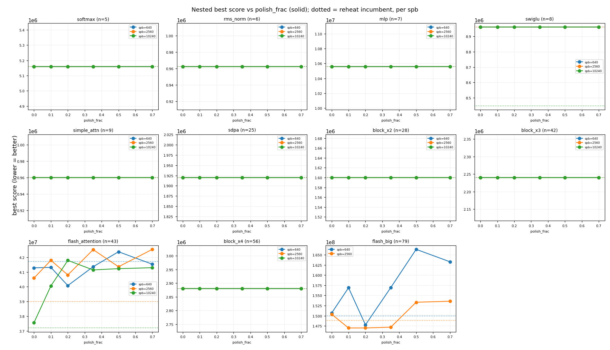

# Nested `polish_frac` sweep

Fixed `nest-greedy-constant`, sweeping `polish_frac` in [0.0, 0.1, 0.2, 0.35, 0.5, 0.7] at long run lengths [640, 2560, 10240] (flash_big capped at 2560), 5 seeds, capacity `footprint//2`. Dotted lines in the plot are the `reheat` incumbent's score at each spb; solid lines are nested vs polish_frac. `polish_frac=0.2` is the current default.

## Headline finding

**More polish does not help -- it hurts. The final layout polish should be off
(`polish_frac=0.0`); it was a wrong hypothesis.** The nested A/B suggested raising
`polish_frac` to close the swiglu / flash_attention shortfalls; this sweep refutes
that:

- **8 of 11 graphs are polish-insensitive** (flat vs `polish_frac`): the inner
  layout loops already reach the optimum, so a final frozen-structure polish adds
  nothing.
- **flash_attention: `polish_frac=0.0` is best and more polish steadily hurts.**
  At spb 10240, `0.0` lands within +1.0% of the incumbent while `0.2` (the current
  default) is +12.3% and `0.7` is +11%. The polish steals budget from the outer
  structural loop and freezes structure on the best-so-far too early. Dropping the
  polish essentially closes the flash_attention gap.
- **swiglu: flat +6.1% at every `polish_frac`.** This gap is *structural*, not a
  layout-investment problem -- nested's outer loop never reaches the better
  division the incumbent's interleaved search finds -- so no amount of layout
  polish touches it. A separate lever (outer-loop exploration / move mix / schedule)
  is needed, not polish.

**Actionable:** set the nested default `polish_frac = 0.0` (drop the final polish).
The inner-loop layout is sufficient; the polish is a mild-to-significant
pessimization on the graphs it was meant to help. The remaining swiglu shortfall
is an outer-loop structural-exploration issue for separate study.

_Caveats: capacity = footprint//2; flash_attention is noisy across seeds at short
spb (the polish=0.2 win at spb 640 does not survive to longer runs); flash_big
capped at spb 2560._

## Best polish_frac vs incumbent, per (graph, run length)

| graph | n | spb | reheat | default(0.2) %vs | best polish | best % vs reheat |
|---|--:|--:|--:|--:|--:|--:|
| softmax | 5 | 640 | 5,160,000 | +0.00 | 0.0 | +0.00 |
| softmax | 5 | 2560 | 5,160,000 | +0.00 | 0.0 | +0.00 |
| softmax | 5 | 10240 | 5,160,000 | +0.00 | 0.0 | +0.00 |
| rms_norm | 6 | 640 | 962,500 | +0.00 | 0.0 | +0.00 |
| rms_norm | 6 | 2560 | 962,500 | +0.00 | 0.0 | +0.00 |
| rms_norm | 6 | 10240 | 962,500 | +0.00 | 0.0 | +0.00 |
| mlp | 7 | 640 | 10,560,000 | +0.00 | 0.0 | +0.00 |
| mlp | 7 | 2560 | 10,560,000 | +0.00 | 0.0 | +0.00 |
| mlp | 7 | 10240 | 10,560,000 | +0.00 | 0.0 | +0.00 |
| swiglu | 8 | 640 | 8,960,000 | +0.00 | 0.0 | +0.00 |
| swiglu | 8 | 2560 | 8,960,000 | +0.00 | 0.0 | +0.00 |
| swiglu | 8 | 10240 | 8,448,000 | +6.06 | 0.0 | +6.06 |
| simple_attn | 9 | 640 | 960,000 | +0.00 | 0.0 | +0.00 |
| simple_attn | 9 | 2560 | 960,000 | +0.00 | 0.0 | +0.00 |
| simple_attn | 9 | 10240 | 960,000 | +0.00 | 0.0 | +0.00 |
| sdpa | 25 | 640 | 1,919,961 | +0.00 | 0.0 | +0.00 |
| sdpa | 25 | 2560 | 1,919,961 | +0.00 | 0.0 | +0.00 |
| sdpa | 25 | 10240 | 1,919,961 | +0.00 | 0.0 | +0.00 |
| block_x2 | 28 | 640 | 1,600,000 | +0.00 | 0.0 | +0.00 |
| block_x2 | 28 | 2560 | 1,600,000 | +0.00 | 0.0 | +0.00 |
| block_x2 | 28 | 10240 | 1,600,000 | +0.00 | 0.0 | +0.00 |
| block_x3 | 42 | 640 | 2,240,000 | +0.00 | 0.0 | +0.00 |
| block_x3 | 42 | 2560 | 2,240,000 | +0.00 | 0.0 | +0.00 |
| block_x3 | 42 | 10240 | 2,240,000 | +0.00 | 0.0 | +0.00 |
| flash_attention | 43 | 640 | 41,707,961 | -3.90 | 0.2 | -3.90 |
| flash_attention | 43 | 2560 | 38,995,961 | +4.64 | 0.0 | +4.10 |
| flash_attention | 43 | 10240 | 37,199,961 | +12.34 | 0.0 | +0.98 |
| block_x4 | 56 | 640 | 2,880,000 | +0.00 | 0.0 | +0.00 |
| block_x4 | 56 | 2560 | 2,880,000 | +0.00 | 0.0 | +0.00 |
| block_x4 | 56 | 10240 | 2,880,000 | +0.00 | 0.0 | +0.00 |
| flash_big | 79 | 640 | 149,999,951 | -1.49 | 0.2 | -1.49 |
| flash_big | 79 | 2560 | 148,831,951 | -1.23 | 0.1 | -1.23 |
