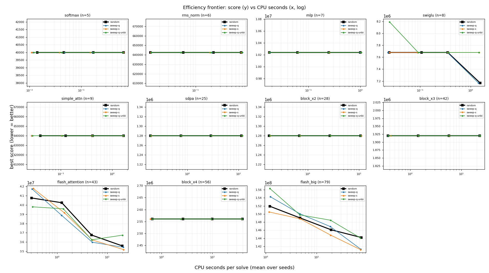
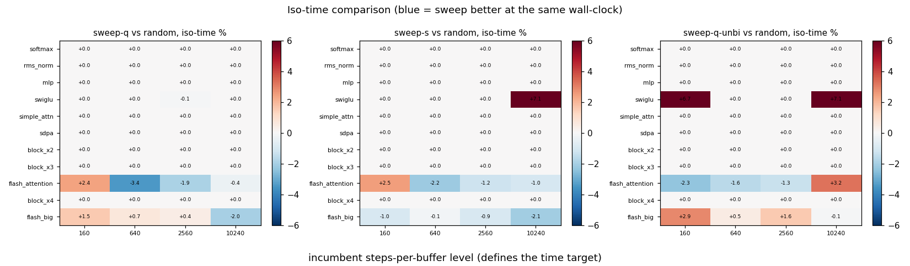

# Best-first reinsertion sweep vs random rotation (co-optimizer A/B)

The co-optimizer's `reorder` move rotates a random buffer to a random position; the layout-only annealer sweeps every reinsertion position and takes them best-first. Arms are compared at **equal wall-clock**: each arm's `steps_per_buffer` grid is derived from a calibration pass so its solve times land on the incumbent's. CPU time (`process_time`) is the cost axis, so pool contention cannot flatter an arm.

## Calibration: cost per step

| graph | n | random us/step | sweep-q us/step | sweep-s us/step | sweep-q-unbi us/step | sweep probes | sweep evals | reorder accept |
|---|--:|--:|--:|--:|--:|--:|--:|--:|
| softmax | 5 | 12.1 (x1.00) | 13.6 (x1.12) | 14.8 (x1.22) | 13.5 (x1.11) | 3.7 | 1.00 | 1.00 |
| rms_norm | 6 | 12.1 (x1.00) | 14.4 (x1.19) | 15.4 (x1.28) | 13.7 (x1.14) | 4.7 | 1.00 | 1.00 |
| mlp | 7 | 13.1 (x1.00) | 13.9 (x1.06) | 13.9 (x1.06) | 14.1 (x1.08) | 5.8 | 1.07 | 0.99 |
| swiglu | 8 | 16.1 (x1.00) | 17.7 (x1.10) | 17.8 (x1.11) | 17.3 (x1.07) | 6.9 | 1.00 | 1.00 |
| simple_attn | 9 | 16.6 (x1.00) | 19.0 (x1.14) | 19.4 (x1.17) | 17.9 (x1.08) | 8.0 | 1.06 | 0.99 |
| sdpa | 25 | 42.0 (x1.00) | 44.1 (x1.05) | 46.4 (x1.10) | 43.5 (x1.04) | 23.9 | 1.00 | 1.00 |
| block_x2 | 28 | 35.1 (x1.00) | 37.3 (x1.06) | 40.6 (x1.16) | 37.7 (x1.08) | 27.0 | 1.00 | 1.00 |
| block_x3 | 42 | 48.2 (x1.00) | 51.3 (x1.06) | 56.9 (x1.18) | 50.9 (x1.06) | 41.0 | 1.00 | 1.00 |
| flash_attention | 43 | 40.9 (x1.00) | 44.9 (x1.10) | 54.1 (x1.32) | 45.8 (x1.12) | 40.6 | 1.00 | 1.00 |
| block_x4 | 56 | 62.4 (x1.00) | 66.9 (x1.07) | 77.3 (x1.24) | 66.8 (x1.07) | 55.0 | 1.00 | 1.00 |
| flash_big | 79 | 88.1 (x1.00) | 98.4 (x1.12) | 124.3 (x1.41) | 96.7 (x1.10) | 76.9 | 1.00 | 1.00 |

## Iso-time comparison

| graph | n | level | cpu s | random score | sweep-q % | sweep-s % | sweep-q-unbi % |
|---|--:|--:|--:|--:|--:|--:|--:|
| softmax | 5 | 160 | 0.01 | 40,000 | +0.00 | +0.00 | +0.00 |
| softmax | 5 | 640 | 0.05 | 40,000 | +0.00 | +0.00 | +0.00 |
| softmax | 5 | 2560 | 0.17 | 40,000 | +0.00 | +0.00 | +0.00 |
| softmax | 5 | 10240 | 0.66 | 40,000 | +0.00 | +0.00 | +0.00 |
| rms_norm | 6 | 160 | 0.01 | 642,500 | +0.00 | +0.00 | +0.00 |
| rms_norm | 6 | 640 | 0.06 | 642,500 | +0.00 | +0.00 | +0.00 |
| rms_norm | 6 | 2560 | 0.22 | 642,500 | +0.00 | +0.00 | +0.00 |
| rms_norm | 6 | 10240 | 0.76 | 642,500 | +0.00 | +0.00 | +0.00 |
| mlp | 7 | 160 | 0.02 | 10,240,000 | +0.00 | +0.00 | +0.00 |
| mlp | 7 | 640 | 0.06 | 10,240,000 | +0.00 | +0.00 | +0.00 |
| mlp | 7 | 2560 | 0.25 | 10,240,000 | +0.00 | +0.00 | +0.00 |
| mlp | 7 | 10240 | 0.99 | 10,240,000 | +0.00 | +0.00 | +0.00 |
| swiglu | 8 | 160 | 0.02 | 7,680,000 | +0.00 | +0.00 | +6.67 |
| swiglu | 8 | 640 | 0.11 | 7,680,000 | +0.00 | +0.00 | +0.00 |
| swiglu | 8 | 2560 | 0.35 | 7,680,000 | -0.09 | +0.00 | +0.00 |
| swiglu | 8 | 10240 | 1.54 | 7,168,000 | +0.00 | +7.14 | +7.14 |
| simple_attn | 9 | 160 | 0.04 | 640,000 | +0.00 | +0.00 | +0.00 |
| simple_attn | 9 | 640 | 0.13 | 640,000 | +0.00 | +0.00 | +0.00 |
| simple_attn | 9 | 2560 | 0.42 | 640,000 | +0.00 | +0.00 | +0.00 |
| simple_attn | 9 | 10240 | 1.68 | 640,000 | +0.00 | +0.00 | +0.00 |
| sdpa | 25 | 160 | 0.19 | 1,280,000 | +0.00 | +0.00 | +0.00 |
| sdpa | 25 | 640 | 0.74 | 1,280,000 | +0.00 | +0.00 | +0.00 |
| sdpa | 25 | 2560 | 2.87 | 1,280,000 | +0.00 | +0.00 | +0.00 |
| sdpa | 25 | 10240 | 11.38 | 1,280,000 | +0.00 | +0.00 | +0.00 |
| block_x2 | 28 | 160 | 0.17 | 1,280,000 | +0.00 | +0.00 | +0.00 |
| block_x2 | 28 | 640 | 0.67 | 1,280,000 | +0.00 | +0.00 | +0.00 |
| block_x2 | 28 | 2560 | 2.68 | 1,280,000 | +0.00 | +0.00 | +0.00 |
| block_x2 | 28 | 10240 | 10.80 | 1,280,000 | +0.00 | +0.00 | +0.00 |
| block_x3 | 42 | 160 | 0.37 | 1,920,000 | +0.00 | +0.00 | +0.00 |
| block_x3 | 42 | 640 | 1.43 | 1,920,000 | +0.00 | +0.00 | +0.00 |
| block_x3 | 42 | 2560 | 5.72 | 1,920,000 | +0.00 | +0.00 | +0.00 |
| block_x3 | 42 | 10240 | 22.75 | 1,920,000 | +0.00 | +0.00 | +0.00 |
| flash_attention | 43 | 160 | 0.31 | 40,760,000 | +2.40 | +2.49 | -2.35 |
| flash_attention | 43 | 640 | 1.24 | 40,244,000 | -3.43 | -2.17 | -1.60 |
| flash_attention | 43 | 2560 | 4.85 | 36,756,000 | -1.91 | -1.24 | -1.32 |
| flash_attention | 43 | 10240 | 19.83 | 35,584,000 | -0.37 | -1.00 | +3.24 |
| block_x4 | 56 | 160 | 0.65 | 2,560,000 | +0.00 | +0.00 | +0.00 |
| block_x4 | 56 | 640 | 2.63 | 2,560,000 | +0.00 | +0.00 | +0.00 |
| block_x4 | 56 | 2560 | 9.97 | 2,560,000 | +0.00 | +0.00 | +0.00 |
| block_x4 | 56 | 10240 | 39.35 | 2,560,000 | +0.00 | +0.00 | +0.00 |
| flash_big | 79 | 160 | 1.21 | 151,920,000 | +1.55 | -0.96 | +2.88 |
| flash_big | 79 | 640 | 4.77 | 149,016,000 | +0.68 | -0.14 | +0.50 |
| flash_big | 79 | 2560 | 19.39 | 146,088,000 | +0.44 | -0.94 | +1.56 |
| flash_big | 79 | 10240 | 75.66 | 144,184,000 | -2.00 | -2.08 | -0.07 |

## Aggregate

| arm | cells | mean % | median % | better | worse | tied |
|---|--:|--:|--:|--:|--:|--:|
| sweep-q | 44 | -0.06 | +0.00 | 5 | 4 | 35 |
| sweep-s | 44 | +0.02 | +0.00 | 7 | 2 | 35 |
| sweep-q-unbi | 44 | +0.38 | +0.00 | 4 | 6 | 34 |

_Negative % = the sweep arm reaches a better (lower) score than the incumbent at the same CPU time. Capacity = footprint//2; scores are the SA fixed-point objective. Cells where an arm's measured time range does not cover the target are left blank rather than extrapolated._

