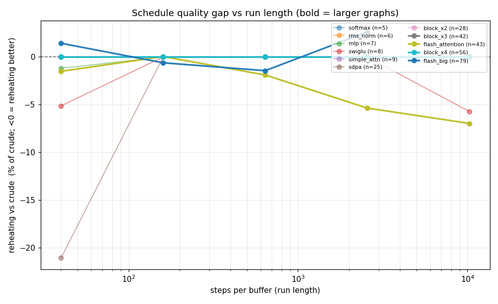
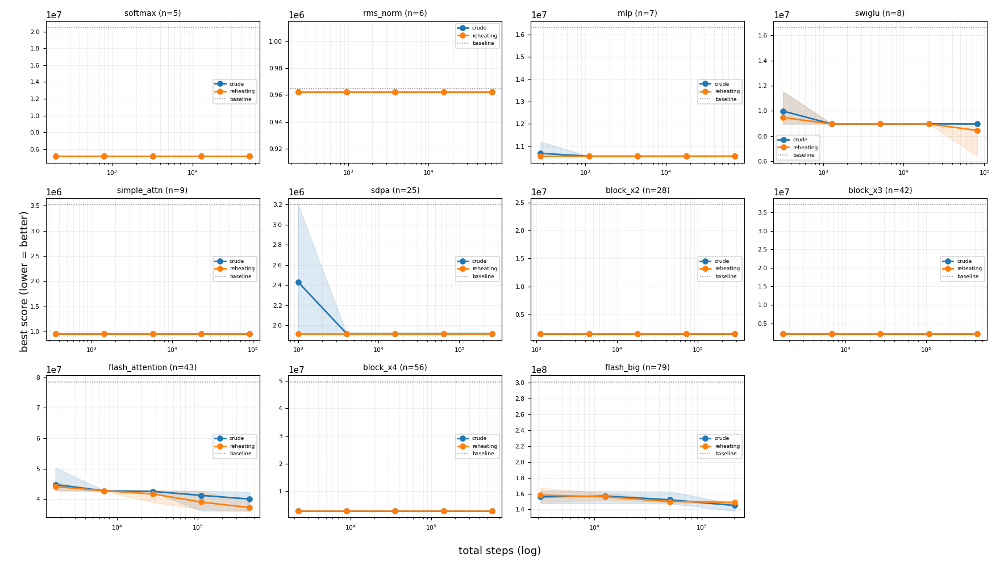

# Co-optimizer schedule sweep: crude vs reheating over run length

Budget sweep over every captured graph, both schedules, 5 seeds per cell, at a geometric `steps_per_buffer` grid. Capacity is `footprint // 2` (the spill-pressured regime where the schedule matters).

## Headline finding

**The advanced (reheating) schedule is not useless on larger graphs; the earlier
apparent regression was a single-seed, shortest-run artifact.** Averaged over 5
seeds:

- **flash_attention (n=43) is the clearest case _for_ the schedule.** Reheating
  wins at every run length and the margin **grows with length** -- from -1.5% at
  1.7k steps to **-7.0% at 440k steps** -- with both schedules still improving but
  reheating pulling ahead (52.6% vs 49.1% over baseline). At the default budget
  with seed 0 this same graph looked ~3% _worse_ under reheating: seed noise, not
  a real regression.
- **sdpa (n=25): reheating converges faster** -- -21% at the shortest run, then
  crude catches up (tie by ~4k steps): reheating reaches the optimum in ~4x fewer
  steps.
- **swiglu (n=8): reheating finds a better _final_ optimum at long runs** (-5.7%
  at 82k steps) that crude never reaches.
- **flash_big (n=79) is inconclusive at this budget.** It only reached 202k steps
  (spb 2560; the 640k-step cell was too costly to fit 2h). Neither schedule
  converged -- both still descending (crude 51.8%, reheating 50.6% over baseline)
  and the +-2-3% deltas sit inside the large seed spread. Settling it needs the
  longer (spb 10240) run.
- **Most graphs are schedule-insensitive** (softmax, rms_norm, mlp, simple_attn,
  block_x2/x3/x4): both schedules reach the same optimum, usually by the shortest
  run, so schedule choice is irrelevant there.

**Answer:** on the one large graph that _converged_ within budget
(flash_attention), the advanced schedule is clearly useful and **more useful at
longer run lengths** -- consistent with "needs longer runs to pay off," not
"useless on large graphs." flash_big specifically needs a longer run to judge.

_Caveats: capacity = footprint//2 throughout; y is the SA fixed-point objective,
not wall-clock; flash_big is undersampled at the top budget._

## Per-graph deltas (mean over seeds)

`delta%` = (reheating - crude) / crude x 100; negative = reheating better.

| graph | n | spb | total steps | crude (mean) | reheating (mean) | delta% |
|---|--:|--:|--:|--:|--:|--:|
| softmax | 5 | 40 | 200 | 5,160,000 | 5,160,000 | +0.00 |
| softmax | 5 | 160 | 800 | 5,160,000 | 5,160,000 | +0.00 |
| softmax | 5 | 640 | 3200 | 5,160,000 | 5,160,000 | +0.00 |
| softmax | 5 | 2560 | 12800 | 5,160,000 | 5,160,000 | +0.00 |
| softmax | 5 | 10240 | 51200 | 5,160,000 | 5,160,000 | +0.00 |
| rms_norm | 6 | 40 | 240 | 962,500 | 962,500 | +0.00 |
| rms_norm | 6 | 160 | 960 | 962,500 | 962,500 | +0.00 |
| rms_norm | 6 | 640 | 3840 | 962,500 | 962,500 | +0.00 |
| rms_norm | 6 | 2560 | 15360 | 962,500 | 962,500 | +0.00 |
| rms_norm | 6 | 10240 | 61440 | 962,500 | 962,500 | +0.00 |
| mlp | 7 | 40 | 280 | 10,688,000 | 10,560,000 | -1.20 |
| mlp | 7 | 160 | 1120 | 10,560,000 | 10,560,000 | +0.00 |
| mlp | 7 | 640 | 4480 | 10,560,000 | 10,560,000 | +0.00 |
| mlp | 7 | 2560 | 17920 | 10,560,000 | 10,560,000 | +0.00 |
| mlp | 7 | 10240 | 71680 | 10,560,000 | 10,560,000 | +0.00 |
| swiglu | 8 | 40 | 320 | 9,984,000 | 9,472,000 | -5.13 |
| swiglu | 8 | 160 | 1280 | 8,960,000 | 8,960,000 | +0.00 |
| swiglu | 8 | 640 | 5120 | 8,960,000 | 8,960,000 | +0.00 |
| swiglu | 8 | 2560 | 20480 | 8,960,000 | 8,960,000 | +0.00 |
| swiglu | 8 | 10240 | 81920 | 8,960,000 | 8,448,000 | -5.71 |
| simple_attn | 9 | 40 | 360 | 960,000 | 960,000 | +0.00 |
| simple_attn | 9 | 160 | 1440 | 960,000 | 960,000 | +0.00 |
| simple_attn | 9 | 640 | 5760 | 960,000 | 960,000 | +0.00 |
| simple_attn | 9 | 2560 | 23040 | 960,000 | 960,000 | +0.00 |
| simple_attn | 9 | 10240 | 92160 | 960,000 | 960,000 | +0.00 |
| sdpa | 25 | 40 | 1000 | 2,431,961 | 1,919,961 | -21.05 |
| sdpa | 25 | 160 | 4000 | 1,919,961 | 1,919,961 | +0.00 |
| sdpa | 25 | 640 | 16000 | 1,919,961 | 1,919,961 | +0.00 |
| sdpa | 25 | 2560 | 64000 | 1,919,961 | 1,919,961 | +0.00 |
| sdpa | 25 | 10240 | 256000 | 1,919,961 | 1,919,961 | +0.00 |
| block_x2 | 28 | 40 | 1120 | 1,600,000 | 1,600,000 | +0.00 |
| block_x2 | 28 | 160 | 4480 | 1,600,000 | 1,600,000 | +0.00 |
| block_x2 | 28 | 640 | 17920 | 1,600,000 | 1,600,000 | +0.00 |
| block_x2 | 28 | 2560 | 71680 | 1,600,000 | 1,600,000 | +0.00 |
| block_x2 | 28 | 10240 | 286720 | 1,600,000 | 1,600,000 | +0.00 |
| block_x3 | 42 | 40 | 1680 | 2,240,000 | 2,240,000 | +0.00 |
| block_x3 | 42 | 160 | 6720 | 2,240,000 | 2,240,000 | +0.00 |
| block_x3 | 42 | 640 | 26880 | 2,240,000 | 2,240,000 | +0.00 |
| block_x3 | 42 | 2560 | 107520 | 2,240,000 | 2,240,000 | +0.00 |
| block_x3 | 42 | 10240 | 430080 | 2,240,000 | 2,240,000 | +0.00 |
| flash_attention | 43 | 40 | 1720 | 44,743,961 | 44,067,961 | -1.51 |
| flash_attention | 43 | 160 | 6880 | 42,687,961 | 42,703,961 | +0.04 |
| flash_attention | 43 | 640 | 27520 | 42,511,961 | 41,707,961 | -1.89 |
| flash_attention | 43 | 2560 | 110080 | 41,203,961 | 38,995,961 | -5.36 |
| flash_attention | 43 | 10240 | 440320 | 39,983,961 | 37,199,961 | -6.96 |
| block_x4 | 56 | 40 | 2240 | 2,880,000 | 2,880,000 | +0.00 |
| block_x4 | 56 | 160 | 8960 | 2,880,000 | 2,880,000 | +0.00 |
| block_x4 | 56 | 640 | 35840 | 2,880,000 | 2,880,000 | +0.00 |
| block_x4 | 56 | 2560 | 143360 | 2,880,000 | 2,880,000 | +0.00 |
| block_x4 | 56 | 10240 | 573440 | 2,880,000 | 2,880,000 | +0.00 |
| flash_big | 79 | 40 | 3160 | 155,895,951 | 158,119,951 | +1.43 |
| flash_big | 79 | 160 | 12640 | 156,927,951 | 155,959,951 | -0.62 |
| flash_big | 79 | 640 | 50560 | 152,191,951 | 149,999,951 | -1.44 |
| flash_big | 79 | 2560 | 202240 | 145,039,951 | 148,831,951 | +2.61 |

## Summary: does reheating catch up at longer runs?

| graph | n | delta% @ shortest | delta% @ longest | trend |
|---|--:|--:|--:|---|
| softmax | 5 | +0.00 | +0.00 | schedule-insensitive (both converge) |
| rms_norm | 6 | +0.00 | +0.00 | schedule-insensitive (both converge) |
| mlp | 7 | -1.20 | +0.00 | reheating faster; crude catches up |
| swiglu | 8 | -5.13 | -5.71 | reheating wins, margin grows with length |
| simple_attn | 9 | +0.00 | +0.00 | schedule-insensitive (both converge) |
| sdpa | 25 | -21.05 | +0.00 | reheating faster; crude catches up |
| block_x2 | 28 | +0.00 | +0.00 | schedule-insensitive (both converge) |
| block_x3 | 42 | +0.00 | +0.00 | schedule-insensitive (both converge) |
| flash_attention | 43 | -1.51 | -6.96 | reheating wins, margin grows with length |
| block_x4 | 56 | +0.00 | +0.00 | schedule-insensitive (both converge) |
| flash_big | 79 | +1.43 | +2.61 | reheating behind (converged? check spread) |
