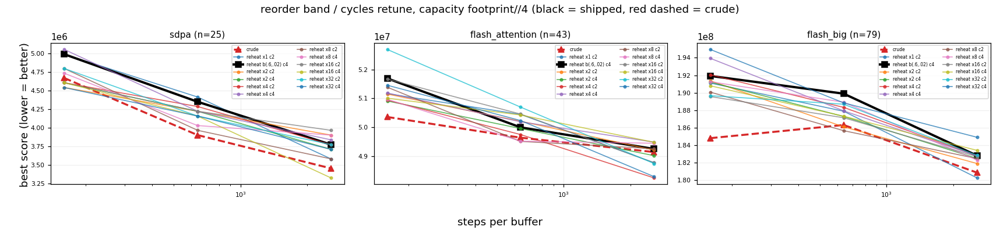

# Retuning the reheating schedule's `reorder` band for the sweep

Capacity `footprint//4`, 10 seeds, `reorder_move` at its default (`sweep_quality`). Band and cycle count do not change per-step work, so equal steps are equal time here and no wall-clock calibration is needed.

Baseline is the shipped `reheat b(.6,.02) c4`; `crude` is the schedule that currently beats it. Negative delta = better than the shipped default. Only graphs where some arm moves are shown: sdpa, flash_attention, flash_big.

## Aggregate over discriminating graphs

| arm | cells | mean % | median % | better | worse | 95% CI (pooled) |
|---|--:|--:|--:|--:|--:|---|
| crude | 9 | -3.93 | -2.58 | 9 | 0 | [-6.42, -1.38] |
| reheat x1 c2 | 9 | -0.84 | -0.96 | 6 | 2 | [-2.87, +1.25] |
| reheat b(.6,.02) c4 | 9 | +0.00 | +0.00 | 0 | 0 | [-1.63, +1.59] |
| reheat x2 c2 | 9 | -1.33 | -0.49 | 7 | 2 | [-3.30, +0.57] |
| reheat x2 c4 | 9 | -1.81 | -1.37 | 9 | 0 | [-3.72, +0.07] |
| reheat x4 c2 | 9 | -1.54 | -0.83 | 6 | 2 | [-3.30, +0.21] |
| reheat x4 c4 | 9 | -0.01 | +0.39 | 4 | 5 | [-1.76, +1.76] |
| reheat x8 c2 | 9 | -2.52 | -0.97 | 8 | 1 | [-4.19, -0.92] |
| reheat x8 c4 | 9 | -1.35 | -0.51 | 7 | 2 | [-3.51, +0.73] |
| reheat x16 c2 | 9 | -0.93 | -0.97 | 7 | 2 | [-2.95, +1.01] |
| reheat x16 c4 | 9 | -2.84 | -1.32 | 6 | 3 | [-4.65, -1.06] |
| reheat x32 c2 | 9 | -0.86 | -0.63 | 5 | 3 | [-2.73, +1.06] |
| reheat x32 c4 | 9 | -1.65 | -0.55 | 6 | 3 | [-3.63, +0.27] |

**Best arm: `crude` (-3.93% vs shipped).**

## Per graph and budget

| graph | n | spb | crude | reheat x1 c2 | reheat b(.6,.02) c4 | reheat x2 c2 | reheat x2 c4 | reheat x4 c2 | reheat x4 c4 | reheat x8 c2 | reheat x8 c4 | reheat x16 c2 | reheat x16 c4 | reheat x32 c2 | reheat x32 c4 |
|---|--:|--:|--:|--:|--:|--:|--:|--:|--:|--:|--:|--:|--:|--:|--:|
| sdpa | 25 | 160 | 4,672,000 | 4,992,000 | 4,992,000 | 4,544,000 | 4,608,000 | 4,608,000 | 5,056,000 | 4,800,000 | 4,736,000 | 4,608,000 | 4,608,000 | 4,800,000 | 4,544,000 |
| sdpa | 25 | 640 | 3,904,000 | 4,416,000 | 4,352,000 | 4,224,000 | 4,224,000 | 4,288,000 | 4,224,000 | 3,968,000 | 4,032,000 | 4,224,000 | 4,160,000 | 4,160,000 | 4,160,000 |
| sdpa | 25 | 2560 | 3,456,000 | 3,584,000 | 3,776,000 | 3,904,000 | 3,712,000 | 3,776,000 | 3,840,000 | 3,584,000 | 3,904,000 | 3,968,000 | 3,328,000 | 3,776,000 | 3,712,000 |
| flash_attention | 43 | 160 | 50,360,000 | 51,164,000 | 51,692,000 | 51,152,000 | 50,912,000 | 50,944,000 | 51,188,000 | 51,388,000 | 50,968,000 | 51,668,000 | 51,008,000 | 52,692,000 | 51,456,000 |
| flash_attention | 43 | 640 | 49,644,000 | 50,448,000 | 50,000,000 | 50,212,000 | 49,960,000 | 49,752,000 | 50,194,000 | 49,516,000 | 49,524,000 | 50,460,000 | 50,428,000 | 50,700,000 | 50,236,000 |
| flash_attention | 43 | 2560 | 49,148,000 | 48,782,000 | 49,256,000 | 49,218,000 | 49,024,000 | 48,256,000 | 49,492,000 | 49,264,000 | 49,452,000 | 48,780,000 | 49,486,000 | 48,752,000 | 48,300,000 |
| flash_big | 79 | 160 | 184,816,000 | 191,108,000 | 191,920,000 | 191,368,000 | 191,216,000 | 192,056,000 | 193,932,000 | 190,072,000 | 191,256,000 | 189,564,000 | 190,796,000 | 189,664,000 | 194,944,000 |
| flash_big | 79 | 640 | 186,320,000 | 187,892,000 | 189,896,000 | 186,104,000 | 187,292,000 | 188,328,000 | 187,932,000 | 185,668,000 | 188,924,000 | 187,144,000 | 187,320,000 | 188,692,000 | 188,844,000 |
| flash_big | 79 | 2560 | 180,880,000 | 180,280,000 | 182,820,000 | 181,920,000 | 182,496,000 | 182,824,000 | 182,788,000 | 182,484,000 | 182,308,000 | 182,708,000 | 183,420,000 | 182,856,000 | 184,916,000 |

_Scores are the SA fixed-point objective, mean over seeds. Graphs whose score is identical under every arm at every budget are omitted._

