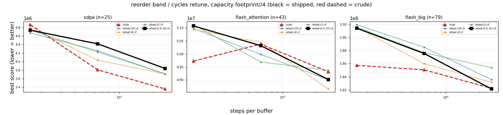

# Retuning the reheating schedule's `reorder` band for the sweep

Capacity `footprint//4`, 20 seeds, `reorder_move` at its default (`sweep_quality`). Band and cycle count do not change per-step work, so equal steps are equal time here and no wall-clock calibration is needed.

Baseline is the shipped `reheat b(.6,.02) c4`; `crude` is the schedule that currently beats it. Negative delta = better than the shipped default. Only graphs where some arm moves are shown: sdpa, flash_attention, flash_big.

## Aggregate over discriminating graphs

| arm | cells | mean % | median % | better | worse | 95% CI (pooled) |
|---|--:|--:|--:|--:|--:|---|
| crude | 9 | -3.30 | -1.34 | 5 | 4 | [-5.07, -1.55] |
| reheat x16 c4 | 9 | -0.85 | -0.20 | 6 | 3 | [-2.35, +0.63] |
| reheat x8 c2 | 9 | -1.29 | -0.25 | 5 | 4 | [-2.96, +0.35] |
| reheat x2 c4 | 9 | -0.69 | +0.06 | 3 | 5 | [-2.31, +0.93] |
| reheat b(.6,.02) c4 | 9 | +0.00 | +0.00 | 0 | 0 | [-1.66, +1.62] |

**Best arm: `crude` (-3.30% vs shipped).**

## Per graph and budget

| graph | n | spb | crude | reheat x16 c4 | reheat x8 c2 | reheat x2 c4 | reheat b(.6,.02) c4 |
|---|--:|--:|--:|--:|--:|--:|--:|
| sdpa | 25 | 160 | 4,864,000 | 4,672,000 | 4,800,000 | 4,736,000 | 4,736,000 |
| sdpa | 25 | 640 | 3,808,000 | 4,256,000 | 4,032,000 | 4,224,000 | 4,416,000 |
| sdpa | 25 | 2560 | 3,360,000 | 3,712,000 | 3,712,000 | 3,712,000 | 3,840,000 |
| flash_attention | 43 | 160 | 49,723,000 | 50,970,000 | 50,940,000 | 51,116,000 | 51,070,000 |
| flash_attention | 43 | 640 | 50,372,000 | 49,980,000 | 50,440,000 | 49,688,000 | 50,314,000 |
| flash_attention | 43 | 2560 | 49,317,000 | 49,009,000 | 48,658,000 | 49,376,000 | 49,018,000 |
| flash_big | 79 | 160 | 185,750,000 | 191,964,000 | 191,610,000 | 191,610,000 | 191,434,000 |
| flash_big | 79 | 640 | 185,070,000 | 188,526,000 | 186,010,000 | 187,684,000 | 187,576,000 |
| flash_big | 79 | 2560 | 182,244,000 | 183,576,000 | 183,184,000 | 185,394,000 | 182,146,000 |

_Scores are the SA fixed-point objective, mean over seeds. Graphs whose score is identical under every arm at every budget are omitted._

