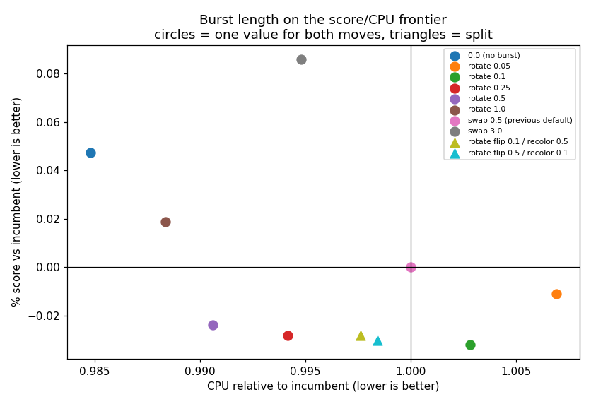

# How long should a structural move's layout burst be?

`burst_fraction` sets the greedy layout pass that runs after a structural move, as a multiple of the buffer count. Arms are calibrated to the incumbent's wall-clock at steps-per-buffer [40, 160], 10 seeds, capacity `footprint//2`. Score is % against the incumbent `swap 0.5 (previous default)` (negative = better); CPU is relative to the same. Acceptance columns are the mechanism -- a burst that earns its keep should raise the acceptance rate of the move it precedes.

## One value for both moves

| flip / recolor | CPU | score % | 95% CI | flip accept | recolor accept |
|---|--:|--:|---|--:|--:|
| 0.0 (no burst) | 0.98x | +0.047 | [-0.042, +0.141] | 26.7% | 35.3% |
| rotate 0.05 | 1.01x | -0.011 | [-0.093, +0.078] | 25.7% | 34.4% |
| rotate 0.1 | 1.00x | -0.032 | [-0.104, +0.034] | 25.9% | 34.8% |
| rotate 0.25 | 0.99x | -0.028 | [-0.101, +0.037] | 26.3% | 34.7% |
| rotate 0.5 | 0.99x | -0.024 | [-0.097, +0.042] | 26.4% | 34.6% |
| rotate 1.0 | 0.99x | +0.019 | [-0.054, +0.090] | 26.6% | 35.3% |
| swap 0.5 (previous default) | 1.00x | +0.000 | [-0.068, +0.072] | 26.8% | 35.7% |
| swap 3.0 | 0.99x | +0.086 | [-0.011, +0.193] | 27.1% | 35.9% |

## Different lengths per move

| flip / recolor | CPU | score % | 95% CI | flip accept | recolor accept |
|---|--:|--:|---|--:|--:|
| rotate flip 0.1 / recolor 0.5 | 1.00x | -0.028 | [-0.101, +0.038] | 26.5% | 35.2% |
| rotate flip 0.5 / recolor 0.1 | 1.00x | -0.030 | [-0.102, +0.034] | 26.3% | 34.6% |

## Verdict

**No arm differs significantly from the incumbent**, in either direction, including `0.0 (no burst)`. On this corpus the burst length is not a lever: the spread across every arm is inside the noise, so the default survives and nothing here recommends changing it. That `0.0` also ties is the more interesting half -- it says the burst is not currently *earning* its cost, which is a claim about this corpus rather than about the mechanism.

**Should the two moves differ?** The best split arm (`rotate flip 0.5 / recolor 0.1`, -0.030%) versus the best shared value (`rotate 0.1`, -0.032%) is a gap of +0.002% — which is the same order as the CIs above, so the asymmetry is not resolvable here. Splitting the knob is supported by the mechanism (a recolor changes far more of the division vector than a flip) but not by this measurement.

**Did the primitive matter?** No. The best rotate arm (`rotate 0.1`, -0.032%) does not separate from the swap arms, and `0.0 (no burst)` at +0.047% is inside the same band as both. The hypothesis behind rebuilding the burst on `rotate` -- that the adjacent swap was too weak a move to adapt the layout -- is not supported: a better-mixing primitive does not make the burst do anything either.

**The burst is inert here, not merely unhelpful.** Across every arm -- from no burst at all to 3n -- flip acceptance moves by 1.5% and recolor acceptance by 1.5%. If the burst were adapting the layout enough to change how Metropolis judges a structural move, acceptance is where it would show, and it does not. The greedy pass is finding nothing that changes the verdict.

That leaves the burst without a demonstrated job on this corpus, under either primitive and at every length from zero to the point where it costs 30% of the budget. The remaining explanations are that the layout simply does not need re-adapting after a division change here -- which the warm-start transfer experiment found to be true at small and medium changes -- or that this corpus converges too early for it to matter, as it does for most knobs measured in this series. Both are claims about the corpus rather than about the mechanism.

