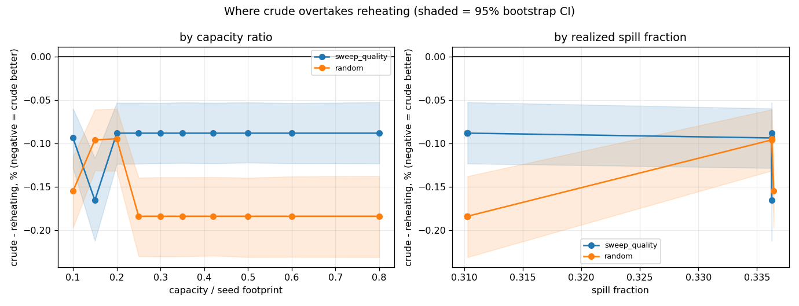

# Where does `crude` overtake `reheating`?

`crude` minus `reheating` as a percent of `reheating`; **negative means crude is better**. Capacity swept as a fraction of the seed footprint (0.5 is the old `//2`, 0.25 the old `//4`), steps-per-buffer 640, seeds 70-89 (out-of-sample against every earlier run). Both reorder moves swept, so the threshold does not depend on the current default move.

## reorder_move = `sweep_quality`

| capacity / footprint | spill fraction | non-tied cells | delta % | 95% CI |
|--:|--:|--:|--:|---|
| 0.80 | 0.31 | 2 | -0.09 **sig** | [-0.12, -0.05] |
| 0.60 | 0.31 | 2 | -0.09 **sig** | [-0.12, -0.05] |
| 0.50 | 0.31 | 2 | -0.09 **sig** | [-0.12, -0.05] |
| 0.42 | 0.31 | 2 | -0.09 **sig** | [-0.12, -0.05] |
| 0.35 | 0.31 | 2 | -0.09 **sig** | [-0.12, -0.05] |
| 0.30 | 0.31 | 2 | -0.09 **sig** | [-0.12, -0.05] |
| 0.25 | 0.31 | 2 | -0.09 **sig** | [-0.12, -0.05] |
| 0.20 | 0.34 | 2 | -0.09 **sig** | [-0.12, -0.05] |
| 0.15 | 0.34 | 1 | -0.17 **sig** | [-0.21, -0.12] |
| 0.10 | 0.34 | 2 | -0.09 **sig** | [-0.13, -0.06] |

No sign change over the swept range.

## reorder_move = `random`

| capacity / footprint | spill fraction | non-tied cells | delta % | 95% CI |
|--:|--:|--:|--:|---|
| 0.80 | 0.31 | 1 | -0.18 **sig** | [-0.23, -0.14] |
| 0.60 | 0.31 | 1 | -0.18 **sig** | [-0.23, -0.14] |
| 0.50 | 0.31 | 1 | -0.18 **sig** | [-0.23, -0.14] |
| 0.42 | 0.31 | 1 | -0.18 **sig** | [-0.23, -0.14] |
| 0.35 | 0.31 | 1 | -0.18 **sig** | [-0.23, -0.14] |
| 0.30 | 0.31 | 1 | -0.18 **sig** | [-0.23, -0.14] |
| 0.25 | 0.31 | 1 | -0.18 **sig** | [-0.23, -0.14] |
| 0.20 | 0.34 | 2 | -0.09 **sig** | [-0.13, -0.06] |
| 0.15 | 0.34 | 2 | -0.10 **sig** | [-0.13, -0.06] |
| 0.10 | 0.34 | 1 | -0.15 **sig** | [-0.20, -0.12] |

No sign change over the swept range.
