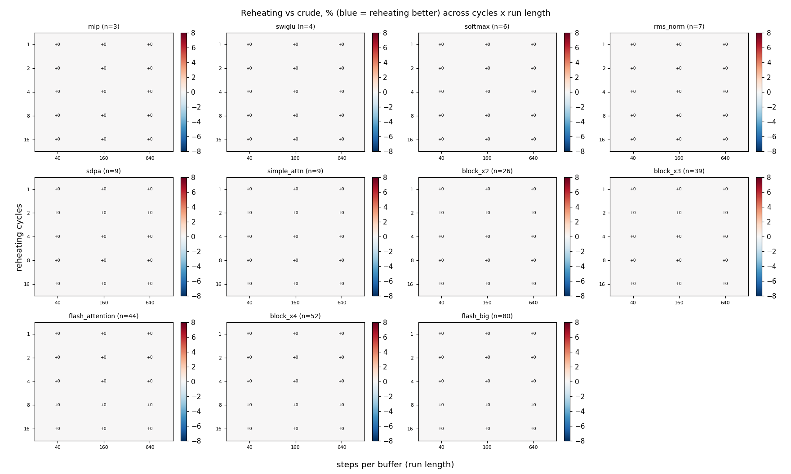
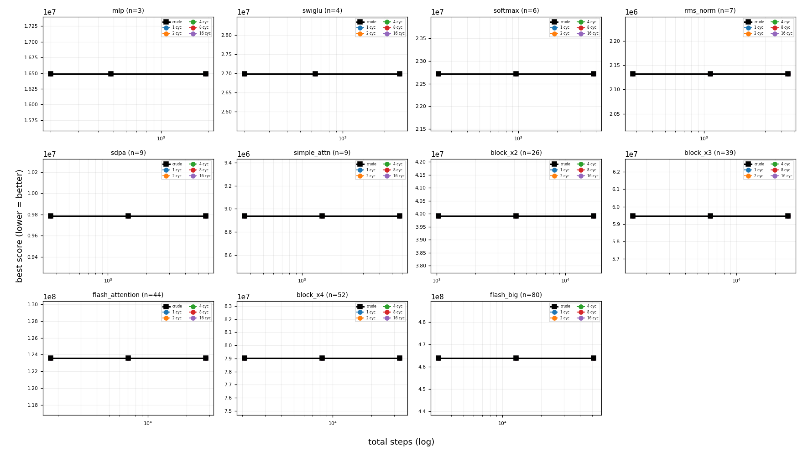

# Reheating cycle-count x run-length product sweep

Reheating schedule with `cycles` in [1, 2, 4, 8, 16] x `steps_per_buffer` in [40, 160, 640], 5 seeds/cell, capacity `footprint//2`. `cycle length = total_steps / cycles`, so `cycles=1` is a single long cool (no reheating) and larger values are more, shorter reheats. Heatmap cells are reheating-vs-crude % (blue/negative = reheating better).

## Headline finding

**The cycle count does not matter on this corpus.** All 11 graphs land the same score at every cycle count from 1 to 16, at every run length in [40, 160, 640]. The default `cycles=4` is therefore free -- and so is any other value, which also means this sweep can no longer distinguish them and should not be cited as support for one.

Cycle-insensitive here means every count in [1, 2, 4, 8, 16] lands within 0.005% at
every run length -- a tie, not a narrow win. 11 of 11 graphs
are in that state.

_Caveats: capacity = footprint//2; y is the cost model's fixed-point prediction,
not measured hardware time. A tie means the search reaches the same place by
every schedule shape, which is a statement about this corpus as much as about the
schedule._

## Best cycle count per (graph, run length)

| graph | n | spb | total steps | best cycles | reheat(best) vs crude % | cycles=4 vs crude % |
|---|--:|--:|--:|--:|--:|--:|
| mlp | 3 | 40 | 200 | 1 | +0.00 | +0.00 |
| mlp | 3 | 160 | 480 | 1 | +0.00 | +0.00 |
| mlp | 3 | 640 | 1920 | 2 | +0.00 | +0.00 |
| swiglu | 4 | 40 | 200 | 1 | +0.00 | +0.00 |
| swiglu | 4 | 160 | 640 | 1 | +0.00 | +0.00 |
| swiglu | 4 | 640 | 2560 | 1 | +0.00 | +0.00 |
| softmax | 6 | 40 | 240 | 1 | +0.00 | +0.00 |
| softmax | 6 | 160 | 960 | 2 | +0.00 | +0.00 |
| softmax | 6 | 640 | 3840 | 2 | +0.00 | +0.00 |
| rms_norm | 7 | 40 | 280 | 1 | +0.00 | +0.00 |
| rms_norm | 7 | 160 | 1120 | 1 | +0.00 | +0.00 |
| rms_norm | 7 | 640 | 4480 | 1 | +0.00 | +0.00 |
| sdpa | 9 | 40 | 360 | 1 | +0.00 | +0.00 |
| sdpa | 9 | 160 | 1440 | 1 | +0.00 | +0.00 |
| sdpa | 9 | 640 | 5760 | 1 | +0.00 | +0.00 |
| simple_attn | 9 | 40 | 360 | 1 | +0.00 | +0.00 |
| simple_attn | 9 | 160 | 1440 | 1 | +0.00 | +0.00 |
| simple_attn | 9 | 640 | 5760 | 4 | +0.00 | +0.00 |
| block_x2 | 26 | 40 | 1040 | 16 | +0.00 | +0.00 |
| block_x2 | 26 | 160 | 4160 | 4 | +0.00 | +0.00 |
| block_x2 | 26 | 640 | 16640 | 2 | +0.00 | +0.00 |
| block_x3 | 39 | 40 | 1560 | 2 | +0.00 | +0.00 |
| block_x3 | 39 | 160 | 6240 | 8 | +0.00 | +0.00 |
| block_x3 | 39 | 640 | 24960 | 1 | +0.00 | +0.00 |
| flash_attention | 44 | 40 | 1760 | 1 | +0.00 | +0.00 |
| flash_attention | 44 | 160 | 7040 | 1 | +0.00 | +0.00 |
| flash_attention | 44 | 640 | 28160 | 8 | +0.00 | +0.00 |
| block_x4 | 52 | 40 | 2080 | 1 | +0.00 | +0.00 |
| block_x4 | 52 | 160 | 8320 | 2 | +0.00 | +0.00 |
| block_x4 | 52 | 640 | 33280 | 1 | +0.00 | +0.00 |
| flash_big | 80 | 40 | 3200 | 1 | +0.00 | +0.00 |
| flash_big | 80 | 160 | 12800 | 1 | +0.00 | +0.00 |
| flash_big | 80 | 640 | 51200 | 1 | +0.00 | +0.00 |
