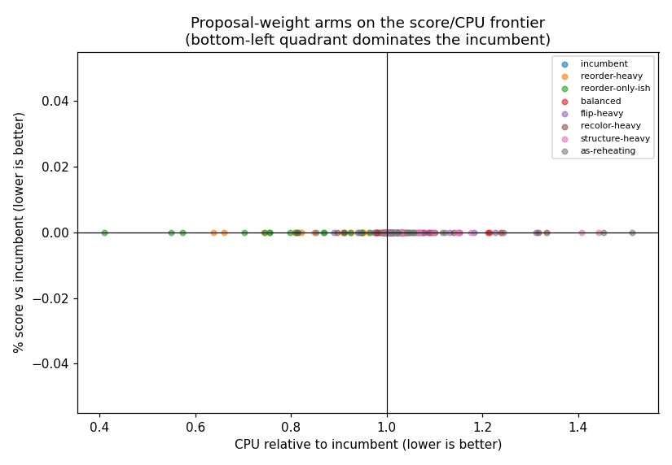

# Crude's proposal weights on the score/CPU frontier

`reorder_weight` / `flip_weight` / `recolor_weight`, swept for the first time. Every arm is calibrated to the incumbent's wall-clock at each of steps-per-buffer [40, 160], 10 seeds, capacity `footprint//2`. Score is % against the incumbent weights (0.5, 0.3, 0.2) (negative = better); CPU is relative to the same. An arm only beats the default if it is at or left of 1.00x CPU *and* at or below 0% score.

## Per arm, pooled

| arm | (reorder, flip, recolor) | proposal mix r/f/c | CPU vs incumbent | score % | 95% CI |
|---|---|---|--:|--:|---|
| `incumbent` | (0.5, 0.3, 0.2) | 48/32/20% | 1.00x | +0.000 | [+0.000, +0.000] |
| `reorder-heavy` | (0.8, 0.1, 0.1) | 79/10/11% | 0.92x | +0.000 | [+0.000, +0.000] |
| `reorder-only-ish` | (0.94, 0.03, 0.03) | 94/3/3% | 0.84x | +0.000 | [+0.000, +0.000] |
| `balanced` | (0.33, 0.33, 0.33) | 32/34/34% | 1.06x | +0.000 | [+0.000, +0.000] |
| `flip-heavy` | (0.2, 0.6, 0.2) | 21/62/18% | 1.05x | +0.000 | [+0.000, +0.000] |
| `recolor-heavy` | (0.2, 0.2, 0.6) | 18/23/59% | 1.03x | +0.000 | [+0.000, +0.000] |
| `structure-heavy` | (0.1, 0.45, 0.45) | 8/48/44% | 1.09x | +0.000 | [+0.000, +0.000] |
| `as-reheating` | (0.05, 0.49, 0.46) | 3/50/47% | 1.08x | +0.000 | [+0.000, +0.000] |

## Verdict

**No arm dominates the incumbent weights.** Nothing swept here is both significantly better on score and no more expensive, so the guessed defaults survive their first contact with evidence -- worth stating plainly rather than leaving as an absence, since this mix was the largest unmeasured surface in the engine.

The frontier, cheapest first: `reorder-only-ish` (0.84x, +0.000%). `incumbent` is **not** on it. Everything here is a ~0.1% score effect against a cost model that has never been checked on hardware, so the frontier's shape is more informative than any single point on it.

**Was the schedule difference ever about cooling?** `as-reheating` puts the reheating schedule's observed mix (~5/49/46) inside the crude schedule, changing the proposal mix and nothing else. It lands at +0.000% score for 1.08x CPU -- the same shape as reheating itself against crude: a small score gain bought with CPU. So the schedule knob is mostly a mix knob, and these three weights largely subsume it. That also means the two are not independent: retuning them re-opens the schedule decision.
