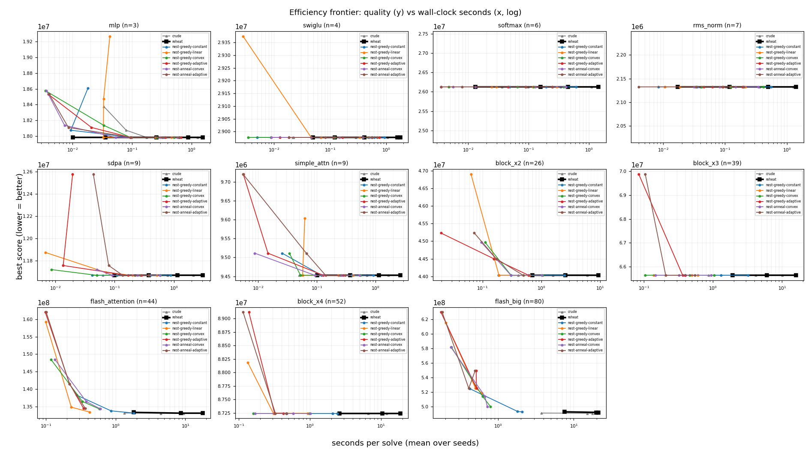

# Nested two-timescale SA vs the single-loop engine (A/B)

Nested variants (greedy/annealed inner x constant/linear/convex/adaptive length curve) vs crude and the incumbent `reheat`, over run length, 5 seeds, capacity `footprint//2`. `delta%` and the frontier are both vs `reheat`. Wall-clock is recorded because the nested inner loop skips the per-step rescore, so quality-vs-time is the honest efficiency axis.

## Headline finding

**The nested engine's win is wall-clock, not plan quality. Read both numbers together or this table will mislead you.** At each graph's longest run length the best nested config scores +0.00% against `reheat` -- a tie, within noise, *not* an improvement -- while taking 8.5x less time (2.3x-29.8x). It ties or beats on 11 of 11 graphs. Every "speedup" below is therefore the price of the same answer, never a better one; the largest are on the largest graphs, where the incumbent's per-step full rescore is most expensive.

That framing matters because of what the extra budget itself buys, which is almost nothing: `reheat` returns a bit-identical score at *every* run length on 11 of 11 graphs, so the search has already converged at the default budget. The time the nested engine saves is therefore time spent on steps that do not change the answer. A speedup on a budget nobody needs is not a reason to adopt it.

Where the win comes from:

- **Skipping the per-step full rescore.** The incumbent scores the whole state
  every step; the nested inner layout loop drives the packer's incremental
  quality and computes the full score once per outer (structural) move. Under the
  cost-model objective a full score is far more expensive than it was under the
  memory-only one, so this advantage is *larger* here than when the nested engine
  was first measured.
- **Warm-started, rotate-based inner loops.** Layout re-adapts to each structural
  change from the persisted permutation, using single-buffer reinsertions (fast
  mixing), not adjacent swaps.

Where the incumbent still wins: none -- no graph favours the incumbent.

### At the default step budget

The grid above starts at `steps_per_buffer=40`, the engine's default and the only point production runs at. There the nested engine ties the incumbent on all 11 graphs (+0.00% on average), so the equal-steps framing above is not hiding a regression at the operating point. It is 6.4x cheaper in solver time, but the absolute saving is fractions of a second per graph.

Read that as the search having converged by the default budget rather than as the nested engine having improved: the whole grid sits above the convergence point, so no arm here can lose.

Secondary findings:

- **Greedy vs annealed inner loop:** the annealed inner loop is worse by +0.00% on average, and 0.00% on the graphs where every config converges to the same score. Greedy-cold remains the robust choice.
- **The inner-length curve barely separates the greedy configs** (`linear` +0.00%, `constant` +0.00%, `convex` +0.00%, `adaptive` +0.00%), so the simplest `constant` inner length is a fine default. The "grow the inner loop over the run" hypothesis is still not strongly supported -- warm-start and rescore-skipping carry the win, not the length schedule.

_Caveats: capacity = footprint//2; y is the cost model's fixed-point prediction, not measured hardware time (the seconds here are solver compute); flash_big capped at spb 2560. Several graphs converge to an identical score across every config and run length, so their +0.00% is a genuine tie, not a rounding artefact._

## Best nested config vs incumbent, per (graph, run length)

| graph | n | spb | reheat score | reheat s | best nested | nested % | nested s | speedup |
|---|--:|--:|--:|--:|---|--:|--:|--:|
| mlp | 3 | 40 | 16,492,790 | 0.07 | nest-greedy-constant | +0.00 | 0.05 | 1.47x |
| mlp | 3 | 160 | 16,492,790 | 0.13 | nest-greedy-constant | +0.00 | 0.05 | 2.49x |
| mlp | 3 | 640 | 16,492,790 | 0.37 | nest-greedy-constant | +0.00 | 0.22 | 1.71x |
| mlp | 3 | 2560 | 16,492,790 | 1.44 | nest-greedy-constant | +0.00 | 0.66 | 2.20x |
| mlp | 3 | 10240 | 16,492,790 | 1.96 | nest-greedy-linear | +0.00 | 0.85 | 2.31x |
| swiglu | 4 | 40 | 26,990,346 | 0.03 | nest-greedy-constant | +0.00 | 0.03 | 0.83x |
| swiglu | 4 | 160 | 26,990,346 | 0.12 | nest-greedy-constant | +0.00 | 0.09 | 1.37x |
| swiglu | 4 | 640 | 26,990,346 | 0.42 | nest-greedy-linear | +0.00 | 0.12 | 3.58x |
| swiglu | 4 | 2560 | 26,990,346 | 1.89 | nest-greedy-linear | +0.00 | 0.41 | 4.62x |
| swiglu | 4 | 10240 | 26,990,346 | 2.35 | nest-greedy-linear | +0.00 | 0.95 | 2.47x |
| softmax | 6 | 40 | 22,719,147 | 0.02 | nest-greedy-constant | +0.00 | 0.01 | 1.71x |
| softmax | 6 | 160 | 22,719,147 | 0.16 | nest-greedy-constant | +0.00 | 0.09 | 1.68x |
| softmax | 6 | 640 | 22,719,147 | 0.49 | nest-greedy-linear | +0.00 | 0.14 | 3.42x |
| softmax | 6 | 2560 | 22,719,147 | 1.89 | nest-greedy-linear | +0.00 | 0.40 | 4.68x |
| rms_norm | 7 | 40 | 2,132,658 | 0.08 | nest-greedy-constant | +0.00 | 0.01 | 7.74x |
| rms_norm | 7 | 160 | 2,132,658 | 0.19 | nest-greedy-constant | +0.00 | 0.08 | 2.43x |
| rms_norm | 7 | 640 | 2,132,658 | 0.70 | nest-greedy-linear | +0.00 | 0.14 | 5.12x |
| rms_norm | 7 | 2560 | 2,132,658 | 1.53 | nest-greedy-linear | +0.00 | 0.38 | 4.07x |
| sdpa | 9 | 40 | 9,786,109 | 0.12 | nest-greedy-constant | +0.00 | 0.07 | 1.62x |
| sdpa | 9 | 160 | 9,786,109 | 0.32 | nest-greedy-constant | +0.00 | 0.23 | 1.42x |
| sdpa | 9 | 640 | 9,786,109 | 1.24 | nest-greedy-linear | +0.00 | 0.21 | 5.84x |
| sdpa | 9 | 2560 | 9,786,109 | 2.43 | nest-greedy-linear | +0.00 | 0.53 | 4.62x |
| simple_attn | 9 | 40 | 8,938,472 | 0.11 | nest-greedy-constant | +0.00 | 0.07 | 1.56x |
| simple_attn | 9 | 160 | 8,938,472 | 0.39 | nest-greedy-linear | +0.00 | 0.05 | 7.99x |
| simple_attn | 9 | 640 | 8,938,472 | 1.49 | nest-greedy-linear | +0.00 | 0.27 | 5.45x |
| simple_attn | 9 | 2560 | 8,938,472 | 4.23 | nest-greedy-linear | +0.00 | 0.50 | 8.48x |
| block_x2 | 26 | 40 | 39,915,356 | 0.80 | nest-greedy-linear | +0.00 | 0.09 | 8.70x |
| block_x2 | 26 | 160 | 39,915,356 | 3.11 | nest-greedy-linear | +0.00 | 0.19 | 16.69x |
| block_x2 | 26 | 640 | 39,915,356 | 9.92 | nest-greedy-linear | +0.00 | 0.71 | 13.91x |
| block_x3 | 39 | 40 | 59,466,493 | 1.82 | nest-greedy-linear | +0.00 | 0.12 | 15.64x |
| block_x3 | 39 | 160 | 59,466,493 | 7.95 | nest-greedy-linear | +0.00 | 0.45 | 17.61x |
| block_x3 | 39 | 640 | 59,466,493 | 19.17 | nest-greedy-linear | +0.00 | 0.64 | 29.85x |
| flash_attention | 44 | 40 | 123,561,124 | 1.96 | nest-greedy-constant | +0.00 | 0.30 | 6.45x |
| flash_attention | 44 | 160 | 123,561,124 | 8.21 | nest-greedy-constant | +0.00 | 1.09 | 7.50x |
| flash_attention | 44 | 640 | 123,561,124 | 16.81 | nest-greedy-linear | +0.00 | 0.75 | 22.52x |
| block_x4 | 52 | 40 | 79,017,629 | 4.00 | nest-greedy-constant | +0.00 | 0.47 | 8.43x |
| block_x4 | 52 | 160 | 79,017,629 | 12.35 | nest-greedy-linear | +0.00 | 0.48 | 25.60x |
| block_x4 | 52 | 640 | 79,017,629 | 20.78 | nest-greedy-linear | +0.00 | 0.94 | 22.12x |
| flash_big | 80 | 40 | 463,802,281 | 7.57 | nest-greedy-linear | +0.00 | 0.22 | 34.90x |
| flash_big | 80 | 160 | 463,802,281 | 24.43 | nest-greedy-linear | +0.00 | 0.71 | 34.24x |
| flash_big | 80 | 640 | 463,802,281 | 24.02 | nest-greedy-linear | +0.00 | 1.06 | 22.76x |
