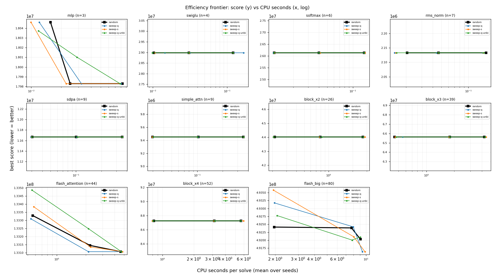

# Best-first reinsertion sweep vs random rotation (co-optimizer A/B)

The co-optimizer's `reorder` move rotates a random buffer to a random position; the layout-only annealer sweeps every reinsertion position and takes them best-first. Arms are compared at **equal wall-clock**: each arm's `steps_per_buffer` grid is derived from a calibration pass so its solve times land on the incumbent's. CPU time (`process_time`) is the cost axis, so pool contention cannot flatter an arm.

## Calibration: cost per step

| graph | n | random us/step | sweep-q us/step | sweep-s us/step | sweep-q-unbi us/step | sweep probes | sweep evals | reorder accept |
|---|--:|--:|--:|--:|--:|--:|--:|--:|
| mlp | 3 | 39.4 (x1.00) | 39.3 (x1.00) | 39.2 (x1.00) | 38.6 (x0.98) | 1.6 | 1.00 | 1.00 |
| swiglu | 4 | 46.0 (x1.00) | 45.7 (x0.99) | 46.3 (x1.01) | 45.9 (x1.00) | 1.5 | 1.00 | 1.00 |
| softmax | 6 | 33.9 (x1.00) | 34.5 (x1.02) | 35.4 (x1.05) | 34.6 (x1.02) | 5.0 | 1.00 | 1.00 |
| rms_norm | 7 | 32.5 (x1.00) | 35.5 (x1.09) | 35.6 (x1.10) | 33.5 (x1.03) | 5.9 | 1.00 | 1.00 |
| sdpa | 9 | 59.2 (x1.00) | 61.2 (x1.03) | 61.4 (x1.04) | 60.1 (x1.02) | 8.0 | 1.00 | 1.00 |
| simple_attn | 9 | 57.9 (x1.00) | 58.3 (x1.01) | 60.5 (x1.05) | 59.8 (x1.03) | 8.0 | 1.00 | 1.00 |
| block_x2 | 26 | 151.3 (x1.00) | 153.5 (x1.01) | 160.6 (x1.06) | 154.4 (x1.02) | 25.0 | 1.00 | 1.00 |
| block_x3 | 39 | 156.9 (x1.00) | 161.2 (x1.03) | 166.4 (x1.06) | 155.7 (x0.99) | 38.0 | 1.00 | 1.00 |
| flash_attention | 44 | 152.2 (x1.00) | 153.5 (x1.01) | 157.6 (x1.04) | 152.3 (x1.00) | 42.3 | 1.00 | 1.00 |
| block_x4 | 52 | 156.4 (x1.00) | 159.9 (x1.02) | 170.4 (x1.09) | 157.4 (x1.01) | 51.0 | 1.00 | 1.00 |
| flash_big | 80 | 165.1 (x1.00) | 163.4 (x0.99) | 171.8 (x1.04) | 164.7 (x1.00) | 78.7 | 1.00 | 1.00 |

## Iso-time comparison

| graph | n | level | cpu s | random score | sweep-q % | sweep-s % | sweep-q-unbi % |
|---|--:|--:|--:|--:|--:|--:|--:|
| mlp | 3 | 40 | 0.02 | 18,046,350 | -0.09 | -0.20 | -0.10 |
| mlp | 3 | 160 | 0.02 | 17,982,871 | +0.09 | +0.00 | +0.18 |
| mlp | 3 | 640 | 0.08 | 17,982,871 | +0.00 | +0.00 | +0.00 |
| swiglu | 4 | 40 | 0.01 | 28,977,122 | -- | +0.00 | +0.00 |
| swiglu | 4 | 160 | 0.03 | 28,977,122 | +0.00 | +0.00 | +0.00 |
| swiglu | 4 | 640 | 0.12 | 28,977,122 | +0.00 | +0.00 | +0.00 |
| softmax | 6 | 40 | 0.01 | 26,127,019 | +0.00 | +0.00 | +0.00 |
| softmax | 6 | 160 | 0.04 | 26,127,019 | +0.00 | +0.00 | +0.00 |
| softmax | 6 | 640 | 0.14 | 26,127,019 | +0.00 | +0.00 | +0.00 |
| rms_norm | 7 | 40 | 0.02 | 2,132,658 | +0.00 | +0.00 | +0.00 |
| rms_norm | 7 | 160 | 0.05 | 2,132,658 | +0.00 | +0.00 | +0.00 |
| rms_norm | 7 | 640 | 0.16 | 2,132,658 | +0.00 | +0.00 | +0.00 |
| sdpa | 9 | 40 | 0.03 | 11,669,380 | +0.00 | +0.00 | +0.00 |
| sdpa | 9 | 160 | 0.10 | 11,669,380 | +0.00 | +0.00 | +0.00 |
| sdpa | 9 | 640 | 0.35 | 11,669,380 | +0.00 | +0.00 | +0.00 |
| simple_attn | 9 | 40 | 0.03 | 9,452,682 | +0.00 | +0.00 | +0.00 |
| simple_attn | 9 | 160 | 0.10 | 9,452,682 | +0.00 | +0.00 | +0.00 |
| simple_attn | 9 | 640 | 0.35 | 9,452,682 | +0.00 | +0.00 | +0.00 |
| block_x2 | 26 | 40 | 0.22 | 44,029,034 | +0.00 | +0.00 | +0.00 |
| block_x2 | 26 | 160 | 0.79 | 44,029,034 | +0.00 | +0.00 | +0.00 |
| block_x2 | 26 | 640 | 2.67 | 44,029,034 | +0.00 | +0.00 | +0.00 |
| block_x3 | 39 | 40 | 0.45 | 65,637,010 | -- | +0.00 | +0.00 |
| block_x3 | 39 | 160 | 1.79 | 65,637,010 | +0.00 | +0.00 | +0.00 |
| block_x3 | 39 | 640 | 4.23 | 65,637,010 | +0.00 | +0.00 | +0.00 |
| flash_attention | 44 | 40 | 0.56 | 133,330,077 | -0.02 | +0.04 | +0.12 |
| flash_attention | 44 | 160 | 2.22 | 133,145,437 | -0.03 | -0.01 | +0.07 |
| flash_attention | 44 | 640 | 4.62 | 133,107,037 | +0.00 | +0.00 | +0.00 |
| block_x4 | 52 | 40 | 0.83 | 87,244,985 | +0.00 | +0.00 | +0.00 |
| block_x4 | 52 | 160 | 3.13 | 87,244,985 | +0.00 | +0.00 | +0.00 |
| block_x4 | 52 | 640 | 5.64 | 87,244,985 | +0.00 | +0.00 | +0.00 |
| flash_big | 80 | 40 | 1.97 | 492,415,009 | +0.15 | +0.23 | +0.07 |
| flash_big | 80 | 160 | 7.73 | 492,388,549 | +0.01 | -0.05 | -0.08 |
| flash_big | 80 | 640 | 9.05 | 492,031,101 | -0.05 | -0.04 | +0.01 |

## Aggregate

| arm | cells | mean % | median % | better | worse | tied |
|---|--:|--:|--:|--:|--:|--:|
| sweep-q | 31 | +0.00 | +0.00 | 4 | 3 | 24 |
| sweep-s | 33 | -0.00 | +0.00 | 4 | 2 | 27 |
| sweep-q-unbi | 33 | +0.01 | +0.00 | 2 | 5 | 26 |

_Negative % = the sweep arm reaches a better (lower) score than the incumbent at the same CPU time. Capacity = footprint//2; scores are the SA fixed-point objective. Cells where an arm's measured time range does not cover the target are left blank rather than extrapolated._
