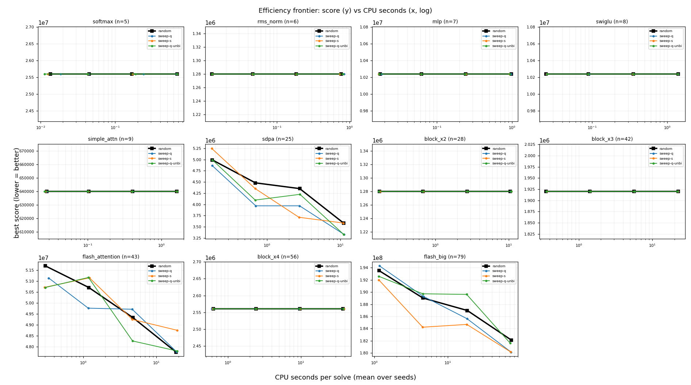
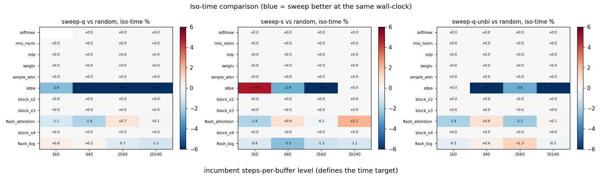

# Best-first reinsertion sweep vs random rotation (co-optimizer A/B)

The co-optimizer's `reorder` move rotates a random buffer to a random position; the layout-only annealer sweeps every reinsertion position and takes them best-first. Arms are compared at **equal wall-clock**: each arm's `steps_per_buffer` grid is derived from a calibration pass so its solve times land on the incumbent's. CPU time (`process_time`) is the cost axis, so pool contention cannot flatter an arm.

## Calibration: cost per step

| graph | n | random us/step | sweep-q us/step | sweep-s us/step | sweep-q-unbi us/step | sweep probes | sweep evals | reorder accept |
|---|--:|--:|--:|--:|--:|--:|--:|--:|
| softmax | 5 | 12.2 (x1.00) | 13.1 (x1.07) | 13.1 (x1.07) | 13.2 (x1.08) | 3.8 | 1.00 | 1.00 |
| rms_norm | 6 | 11.0 (x1.00) | 13.6 (x1.23) | 14.5 (x1.32) | 13.2 (x1.20) | 4.9 | 1.00 | 1.00 |
| mlp | 7 | 12.6 (x1.00) | 13.4 (x1.06) | 14.6 (x1.15) | 13.6 (x1.08) | 5.6 | 1.02 | 1.00 |
| swiglu | 8 | 15.8 (x1.00) | 16.5 (x1.04) | 17.1 (x1.08) | 16.7 (x1.05) | 6.9 | 1.00 | 1.00 |
| simple_attn | 9 | 16.2 (x1.00) | 18.1 (x1.12) | 18.8 (x1.16) | 17.9 (x1.10) | 7.9 | 1.22 | 0.97 |
| sdpa | 25 | 40.1 (x1.00) | 42.5 (x1.06) | 45.6 (x1.14) | 41.8 (x1.04) | 23.6 | 1.19 | 0.99 |
| block_x2 | 28 | 34.8 (x1.00) | 37.6 (x1.08) | 40.4 (x1.16) | 36.3 (x1.05) | 27.0 | 1.00 | 1.00 |
| block_x3 | 42 | 49.0 (x1.00) | 52.6 (x1.07) | 58.2 (x1.19) | 52.0 (x1.06) | 41.0 | 1.00 | 1.00 |
| flash_attention | 43 | 40.2 (x1.00) | 44.8 (x1.12) | 53.6 (x1.33) | 43.6 (x1.08) | 40.2 | 1.01 | 1.00 |
| block_x4 | 56 | 61.9 (x1.00) | 66.3 (x1.07) | 75.0 (x1.21) | 65.2 (x1.05) | 55.0 | 1.00 | 1.00 |
| flash_big | 79 | 84.0 (x1.00) | 91.9 (x1.09) | 118.1 (x1.41) | 91.6 (x1.09) | 77.0 | 1.01 | 1.00 |

## Iso-time comparison

| graph | n | level | cpu s | random score | sweep-q % | sweep-s % | sweep-q-unbi % |
|---|--:|--:|--:|--:|--:|--:|--:|
| softmax | 5 | 160 | 0.01 | 25,600,000 | -- | +0.00 | +0.00 |
| softmax | 5 | 640 | 0.05 | 25,600,000 | +0.00 | +0.00 | +0.00 |
| softmax | 5 | 2560 | 0.17 | 25,600,000 | +0.00 | +0.00 | +0.00 |
| softmax | 5 | 10240 | 0.67 | 25,600,000 | +0.00 | +0.00 | +0.00 |
| rms_norm | 6 | 160 | 0.01 | 1,280,000 | +0.00 | +0.00 | +0.00 |
| rms_norm | 6 | 640 | 0.05 | 1,280,000 | +0.00 | +0.00 | +0.00 |
| rms_norm | 6 | 2560 | 0.18 | 1,280,000 | +0.00 | +0.00 | +0.00 |
| rms_norm | 6 | 10240 | 0.76 | 1,280,000 | +0.00 | +0.00 | +0.00 |
| mlp | 7 | 160 | 0.02 | 10,240,000 | +0.00 | +0.00 | +0.00 |
| mlp | 7 | 640 | 0.06 | 10,240,000 | +0.00 | +0.00 | +0.00 |
| mlp | 7 | 2560 | 0.24 | 10,240,000 | +0.00 | +0.00 | +0.00 |
| mlp | 7 | 10240 | 0.98 | 10,240,000 | +0.00 | +0.00 | +0.00 |
| swiglu | 8 | 160 | 0.02 | 10,240,000 | +0.00 | +0.00 | +0.00 |
| swiglu | 8 | 640 | 0.09 | 10,240,000 | +0.00 | +0.00 | +0.00 |
| swiglu | 8 | 2560 | 0.35 | 10,240,000 | +0.00 | +0.00 | +0.00 |
| swiglu | 8 | 10240 | 1.39 | 10,240,000 | +0.00 | +0.00 | +0.00 |
| simple_attn | 9 | 160 | 0.03 | 640,000 | +0.00 | +0.00 | +0.00 |
| simple_attn | 9 | 640 | 0.10 | 640,000 | +0.00 | +0.00 | +0.00 |
| simple_attn | 9 | 2560 | 0.41 | 640,000 | +0.00 | +0.00 | +0.00 |
| simple_attn | 9 | 10240 | 1.62 | 640,000 | +0.00 | +0.00 | +0.00 |
| sdpa | 25 | 160 | 0.18 | 4,992,000 | -2.58 | +4.89 | +0.00 |
| sdpa | 25 | 640 | 0.70 | 4,480,000 | -11.28 | -2.93 | -8.56 |
| sdpa | 25 | 2560 | 2.79 | 4,352,000 | -8.86 | -14.75 | -2.96 |
| sdpa | 25 | 10240 | 11.03 | 3,584,000 | -6.88 | +0.00 | -7.01 |
| block_x2 | 28 | 160 | 0.17 | 1,280,000 | +0.00 | +0.00 | +0.00 |
| block_x2 | 28 | 640 | 0.68 | 1,280,000 | +0.00 | +0.00 | +0.00 |
| block_x2 | 28 | 2560 | 2.72 | 1,280,000 | +0.00 | +0.00 | +0.00 |
| block_x2 | 28 | 10240 | 10.54 | 1,280,000 | +0.00 | +0.00 | +0.00 |
| block_x3 | 42 | 160 | 0.36 | 1,920,000 | +0.00 | +0.00 | +0.00 |
| block_x3 | 42 | 640 | 1.42 | 1,920,000 | +0.00 | +0.00 | +0.00 |
| block_x3 | 42 | 2560 | 5.61 | 1,920,000 | +0.00 | +0.00 | +0.00 |
| block_x3 | 42 | 10240 | 22.60 | 1,920,000 | +0.00 | +0.00 | +0.00 |
| flash_attention | 43 | 160 | 0.31 | 51,692,000 | -1.07 | -1.87 | -1.90 |
| flash_attention | 43 | 640 | 1.20 | 50,708,000 | -1.86 | +0.85 | +0.86 |
| flash_attention | 43 | 2560 | 4.79 | 49,332,000 | +0.71 | -0.18 | -2.16 |
| flash_attention | 43 | 10240 | 18.49 | 47,764,000 | +0.08 | +2.10 | +0.12 |
| block_x4 | 56 | 160 | 0.63 | 2,560,000 | +0.00 | +0.00 | +0.00 |
| block_x4 | 56 | 640 | 2.42 | 2,560,000 | +0.00 | +0.00 | +0.00 |
| block_x4 | 56 | 2560 | 9.70 | 2,560,000 | +0.00 | +0.00 | +0.00 |
| block_x4 | 56 | 10240 | 37.89 | 2,560,000 | +0.00 | +0.00 | +0.00 |
| flash_big | 79 | 160 | 1.15 | 193,536,000 | +0.39 | -0.80 | -0.49 |
| flash_big | 79 | 640 | 4.58 | 189,032,000 | +0.17 | -2.53 | +0.36 |
| flash_big | 79 | 2560 | 18.43 | 186,984,000 | -0.74 | -1.25 | +1.35 |
| flash_big | 79 | 10240 | 73.21 | 182,136,000 | -1.08 | -1.06 | -0.28 |

## Aggregate

| arm | cells | mean % | median % | better | worse | tied |
|---|--:|--:|--:|--:|--:|--:|
| sweep-q | 43 | -0.77 | +0.00 | 8 | 4 | 31 |
| sweep-s | 44 | -0.40 | +0.00 | 8 | 3 | 33 |
| sweep-q-unbi | 44 | -0.47 | +0.00 | 7 | 4 | 33 |

_Negative % = the sweep arm reaches a better (lower) score than the incumbent at the same CPU time. Capacity = footprint//4; scores are the SA fixed-point objective. Cells where an arm's measured time range does not cover the target are left blank rather than extrapolated._

